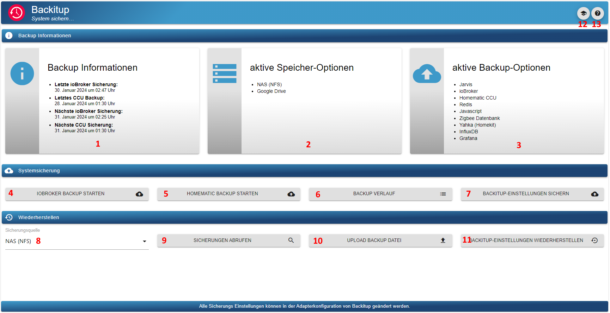
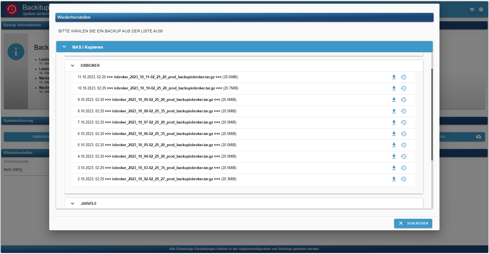
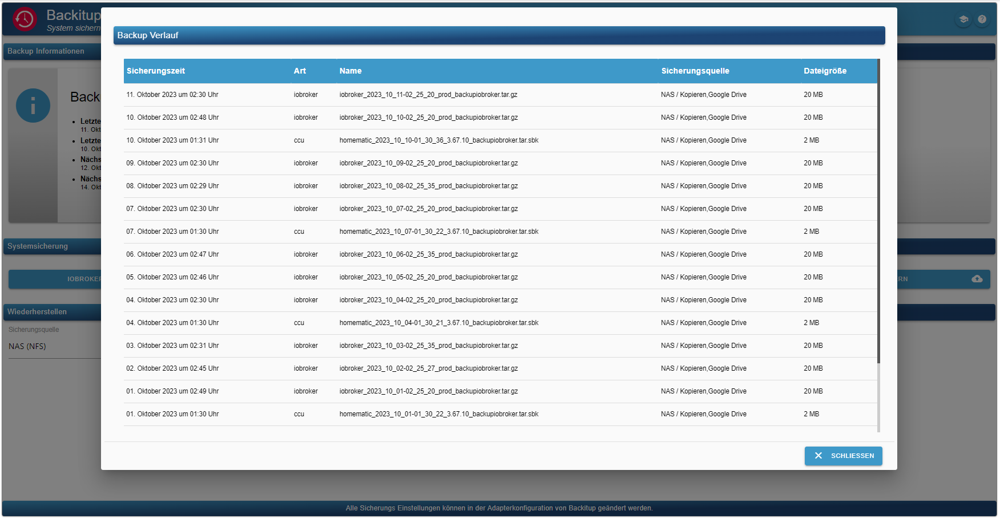

# Dokumentation und Anleitung für ioBroker.backitup


[](https://www.npmjs.com/package/iobroker.backitup)
[](https://www.npmjs.com/package/iobroker.backitup)
[](https://snyk.io/test/github/simatec/ioBroker.backitup)


[](https://github.com/simatec/ioBroker.backitup/blob/master/LICENSE)
[](https://paypal.me/mk1676)
[](https://github.com/sponsors/simatec)

**************************************************************************************************************


## Unterstütze die Adapterentwicklung
**Wenn Ihnen ioBroker.backitup gefällt, denken Sie bitte über eine Spende nach:**
  
[](https://paypal.me/mk1676)


**************************************************************************************************************

## Haftungsausschluss
**ioBroker.backitup ist ein Backup-Plugin nur für die Smart Home Software ioBroker.**<br>
**Es steht in keiner Verbindung zu [Nero BackItUp](https://www.nero.com/deu/products/nero-backitup/?vlang=de) (ein Tool zur Datensicherung unter Windows-Systemen) und wird auch nicht von diesem unterstützt.**

**************************************************************************************************************

## Grundlegendes
ioBroker.backitup ist eine Backuplösung, mit der das zyklische Sichern einer ioBroker-Installation sowie einer Homematic CCU möglich ist.

Der Adapter ist für Multiplattformen geeignet und kann neben Linux-Installationen auch auf Windows und Mac Installationen verwendet werden.

Des Weiteren besteht die Möglichkeit, verschiedene optionale Backups wie z.B. SQL-Datenbanken, Influx-Datenbanken und einige Adapter- und Geräteeinstellungen zu sichern.

ioBroker.backitup arbeitet sehr eng mit dem js-controller zusammen und erstellt ein ioBroker Backup identisch dem CLI Befehl `iobroker backup`.

Es werden hier identisch dem Standard Backup des js-controllers alle States und Objects, sowie die Nutzerdateien wie z.B. VIS gesichert.

Auch der Restore ist komplett identisch dem CLI Befehl `iobroker restore <backupname>` des js-controllers.


Bei einem Restore werden alle States, Objects und Nutzerdaten von ioBroker.backitup wiederhergestellt.
Nach dem Restore startet euer iobroker neu und ab da übernimmt die Installation fehlender Adapter dann wieder der js-controller.

ioBroker.backitup hat nach dem Start des iobrokers keinerlei Einfluss auf die Wiederherstellung. Dies passiert alles im Hintergrund und übernimmt der js-controller anhand der wiederhergestellten Informationen in den States und Objects.

Im Gegensatz zu dem CLI Befehl kann aber ioBroker.backitup auch noch einen Restore der verschiedenen optinalen Backups durchführen.
Dies ist über die CLI nicht möglich.

_[Zurück zum Anfang](#dokumentation-und-anleitung-für-iobrokerbackitup)_

---

## Abhängigkeiten
* Für den CIFS Mount muss zwingend cifs-utils installiert sein.
    - `sudo apt install cifs-utils`

* Für den NFS Mount muss zwingend nfs-common installiert sein.
    - `sudo apt install nfs-common`

* Für die Verwendung des MySql-Backups von MySql Systemen muss mysqldump auf dem System installiert sein
    - `sudo apt install mysql-client` oder unter Debian `sudo apt install default-mysql-client`

* Für die Verwendung des MySql-Backups von MariaDB Systemen muss mysqldump auf dem System installiert sein
    - `sudo apt install mariadb-client`

* Für die Verwendung des Sqlite3-Backups muss sqlite3 auf dem System installiert sein
    - `sudo apt install sqlite3`

* Für die Verwendung des PostgreSQL-Backups muss mysqldump auf dem System installiert sein
    - [Installationsanleitung PostgreSQL](https://www.postgresql.org/download/linux/debian/)

* Für die Verwendung des InfluxDB Backups muss influxd installiert sein
    - [Installationsanleitung InfluxDB 1.x](https://docs.influxdata.com/influxdb/v1.8/introduction/install/)
    - [Installationsanleitung InfluxDB 2.x](https://docs.influxdata.com/influxdb/v2.1/install/)
    - [Installationsanleitung Influx-CLI für 2.x](https://docs.influxdata.com/influxdb/v2.1/tools/influx-cli/?t=Linux)

_[Zurück zum Anfang](#dokumentation-und-anleitung-für-iobrokerbackitup)_

---

## Benutzung und Bedienung
ioBroker.backitup kann in den Adapter-Instanzen konfiguriert werden. Dort stehen alle folgenden Einstellungsmöglichkeiten zur Verfügung.<br><br>
Für die tägliche Arbeit und Bedienung von ioBroker.backitup steht im Admin-Tab ein Reiter zur Verfügung.<br>
Ist dieser Reiter im Tab-Menü der Admin-Oberfläche aktiv, kann ioBroker.backitup direkt über den Reiter in der linken Tab-Leiste des ioBrokers bedient werden.<br><br>
Dort stehen Informationen zu den erstellten Backups zur Verfügung, es können Backups erstellt werden und es besteht die Möglichkeit, einen Restore des Backups auszuführen.



Hier eine kurze Erklärung der Optionen im Tab Menü


| Nr.           | Beschreibung  |
| ------------- | ------------- |
| 1.    | Informationen zum letzten und nächsten Backup. |
| 2.    | Informationen, wo die Backups gespeichert werden. |
| 3.    | Informationen, welche Backuptypen aktiv sind und gesichert werden. |
| 4.    | Ein iobroker Backup manuell starten. |
| 5.    | Ein Homematic Backup manuell starten. |
| 6.    | Öffnet ein neues Fenster und zeigt alle Backups aus dem Verlauf an. |
| 7.    | Mit diesem Button kann man die Settings von ioBroker.backitup sichern. Dies ist bei einem Systemwechsel ein nützliches Hilfsmittel. Die Settings werden im JSON Format ausgegeben. |
| 8.    | In dieser Option wählt man den Speicher, aus dem der Restore ausgeführt werden soll. |
| 9.    | Mit dem Button "Sicherungen abrufen" öffnet sich ein neues Fenster und listet alle vorhanden Backups in dem gewählten Speicher auf. |
| 10.   | Möchte man ein Backup von einem anderen System wiederherstellen, kann die Backupdatei über diesen Button auf das System hochgeladen werden. |
| 11.   | Dieser Button dient dazu, die gespeicherten ioBroker.backitup Settings innerhalb des Adapter wiederherzustellen. Es ist kein Restore des ioBrokers und hier können nur Dateien im JSON Format hochgeladen werden! |
| 12.   | Öffnet ein neuen Tab und zeigt die Dokumentation von ioBroker.backitup an. |
| 13.   | Öffnet ein neuen Tab und zeigt die Readme von ioBroker.backitup an. |




Die Bedienung des Restore Tabs sieht wie folgt aus.


| Nr.           | Beschreibung                                  |
| ------------- | -------------                                 |
| 1.            | Download des gewählten Backups auf den PC.    |
| 2.            | Start des Restores des gewählten Backups.      |
| 3.            | Informationen zum Backup.                     |
| 4.            | Informationen zum Backuptyp.                  |




_[Zurück zum Anfang](#dokumentation-und-anleitung-für-iobrokerbackitup)_

---

## Backuptypen
ioBroker.backitup bietet sehr viele Möglichkeiten, verschiedene Backuptypen zyklisch oder auf Knopfdruck durchzuführen. Jedes Backup wird standardmäßig im Verzeichnis /opt/iobroker/backups abgelegt. Optional kann ein FTP-Upload eingerichtet oder alternativ ein CIFS/NFS-Mount genutzt werden.

### ioBroker Backup
Dieses Backup entspricht dem in ioBroker enthaltenen Backup, welches man in der Konsole über den Aufruf `iobroker backup` starten kann. Nur wird es hier durch die festgelegten Einstellungen in der Adapterkonfiguration oder dem Widget OneClick-Backup durchgeführt, ohne die Konsole verwenden zu müssen.

### CCU Backup (Homematic)
Dieses Backup bietet die Möglichkeit, drei verschiedene Varianten einer Homematic Installation (CCU-Original / pivCCU / Raspberrymatic) zu sichern. Auch die Ausführung dieses Backups kann durch die festgelegten Einstellungen in der Adapterkonfiguration oder dem Widget OneClick-Backup durchgeführt werden.<br><br>
Wer nicht nur eine CCU sichern will, kann die Option "Sicherung mehrerer Systeme" aktivieren und im Anschluss seine Homematic Zentralen in der Tabelle definieren.

> [!IMPORTANT]
> Ein Backup der CCU kann nur mit dem User `Admin` der CCU durchgeführt werden!

### Mysql-Backup
Dieses separat einstellbare Backup wird, sofern es aktiviert ist, bei jedem Backup ioBroker erstellt und nach Ablauf der angegebenen Vorhaltezeit auch gelöscht. FTP oder CIFS sind für dieses Backup ebenfalls gültig, sofern bei den anderen ioBroker-Backup-Typen eingestellt.<br><br>
Wichig hierbei ist, dass auch wenn der Mysql-Server auf einem entfernten System läuft, die mysqldump auf dem ioBroker System laufen muss.<br>Für Linuxsysteme wäre der Installationsbefehl wie folgt: `sudo apt install mysql-client` oder unter Debian `sudo apt install default-mysql-client` bzw. für MariaDB Systeme `sudo apt install mariadb-client`.<br><br>
Wer nicht nur eine Datenbank sichern will, kann die Option "Sicherung mehrerer Systeme" aktivieren und im Anschluss seine Datenbanken in der Tabelle definieren.

### Sqlite3-Backup
Dieses separat einstellbare Backup wird, sofern es aktiviert ist, bei jedem Backup ioBroker erstellt und nach Ablauf der angegebenen Vorhaltezeit auch gelöscht. FTP oder CIFS sind für dieses Backup ebenfalls gültig, sofern bei den anderen ioBroker-Backup-Typen eingestellt.<br><br>
Auf dem Host-System muss Sqlite3 (`sudo apt install sqlite3`) installiert sein. 

### Redis-Backup
Dieses separat einstellbare Backup wird, sofern es aktiviert ist, bei jedem Backup ioBroker erstellt und nach Ablauf der angegebenen Vorhaltezeit auch gelöscht. FTP oder CIFS sind für dieses Backup ebenfalls gültig, sofern bei den anderen ioBroker-Backup-Typen eingestellt.<br>
Zur Verwendung von Redis mit ioBroker.backitup sollten die Rechte für den iobroker-User angepasst werden:<br>
```
sudo usermod -a -G redis iobroker
sudo reboot
```

Für ein Remote-Backup wird auf dem lokalen ioBroker System redis-cli benötigt.

`sudo apt install redis-tools`


Hier müsst ihr euren Host und Port des entfernten Redis Servers angeben und die Login Daten eures Systems.

Dies ist gerade für Docker User ein wichtiges Feature.

Bitte beachtet, dass ein Redis Restore für Remote Systeme nicht über die ioBroker.backitup GUI möglich ist, da Redis dies nicht unterstützt.
Hier muss die im tar.gz Archiv enthaltene dump.rdb händisch wiederhergestellt werden, indem das Backup-Archiv entpackt und die Datei in das Redis Verzeichnis kopiert wird, sowie die Rechte für die dump.rdb angepasst werden.

Hier ein Beispiel:
```
sudo tar -xvzf <Backupdatei>.tar.gz /var/lib/redis/
sudo chown redis:redis /var/lib/redis/dump.rdb
redis-cli shutdown nosave
```

### History Daten Backup
Dieses separat einstellbare Backup wird, sofern es aktiviert ist, bei jedem Backup ioBroker erstellt und nach Ablauf der angegebenen Vorhaltezeit auch gelöscht. FTP oder CIFS sind für dieses Backup ebenfalls gültig, sofern bei den anderen ioBroker-Backup-Typen eingestellt.

### InfluxDB-Backup
Dieses separat einstellbare Backup wird, sofern es aktiviert ist, bei jedem Backup ioBroker erstellt und nach Ablauf der angegebenen Vorhaltezeit auch gelöscht. FTP oder CIFS sind für dieses Backup ebenfalls gültig, sofern bei den anderen ioBroker-Backup-Typen eingestellt.<br><br>
**Voraussetzungen für ein Remote Backup mit InfluxDB v1.x:**

Für das Remote Backup unter InfluxDB 1.x sind einige Anpassungen nötig.

**Um ein InfluxDB Backup ausführen zu können, muss Influxd auf dem iobroker-System installiert sein.**<br>
**Hierbei ist es egal, ob die Datenbank lokal verwaltet wird oder auf einen anderen Server läuft.**<br><br>
Wenn die InfluxDB von einem entfernten Server gesichert werden soll, müssen in der influxdb.conf auf dem entfernten Server die Remote-Rechte für den RPC-Dienst angepasst werden.

```
bind-address = "<InfluxDB-IP>:8088"
```
oder 
```
bind-address = "0.0.0.0:8088"
```

**Nach dem Änderungen in der Konfiguration muss der InfluxDB-Dienst neugestartet werden.**

Weitere Informationen zur Datensicherung der InfluxDB sind [hier](https://docs.influxdata.com/influxdb/v1.8/administration/backup_and_restore/#online-backup-and-restore-for-influxdb-oss) zu finden.<br><br>

**Voraussetzungen für ein Backup mit InfluxDB v2.x:**

Um ein Backup einer InfluxDB 2.x erstellen zu können, muss Influx-CLI auf eurem System installiert sein.
Dies ist sowohl bei einem lokalen als auch bei einem Remote Backup erforderlich.

Bei einem Remote Backup muss Influx-CLI auf dem System installiert sein, auf dem auch euer ioBroker läuft.
Auf dem entfernten System, in dem eure Datenbank arbeitet, ist die Installation für ein Backup nicht erforderlich.

Hier findet Ihr die offizielle Anleitung, wie Ihr Influx-CLI auf eurem System installieren könnt.

[Installationsanleitung Influx-CLI für 2.x](https://docs.influxdata.com/influxdb/v2.1/tools/influx-cli/?t=Linux)<br><br>

Wer nicht nur eine Datenbank sichern will, kann die Option "Sicherung mehrerer Systeme" aktivieren und im Anschluss seine Datenbanken in der Tabelle definieren.<br>

> [!IMPORTANT]
> Um ein InfluxDB2 Backup zu erstellen und es auch wiederherstellen zu können, wird der Operator-Token benötigt!

### PostgreSQL-Backup
Dieses separat einstellbare Backup wird, sofern es aktiviert ist, bei jedem Backup ioBroker erstellt und nach Ablauf der angegebenen Vorhaltezeit auch gelöscht. FTP oder CIFS sind für dieses Backup ebenfalls gültig, sofern bei den anderen ioBroker-Backup-Typen eingestellt.<br><br>
Wichig hierbei ist, dass auch wenn der PostgreSQL-Server auf einem entfernten System läuft, die PostgreSQL auf dem ioBroker System laufen muss.<br>Für Linuxsysteme gibt es [hier](https://www.postgresql.org/download/linux/debian/) eine Installationsanleitung.<br><br>
Wer nicht nur eine Datenbank sichern will, kann die Option "Sicherung mehrerer Systeme" aktivieren und im Anschluss seine Datenbanken in der Tabelle definieren.

### Javascript-Backup
Dieses separat einstellbare Backup wird, sofern es aktiviert ist, bei jedem Backup ioBroker erstellt und nach Ablauf der angegebenen Vorhaltezeit auch gelöscht. FTP oder CIFS sind für dieses Backup ebenfalls gültig, sofern bei den anderen ioBroker-Backup-Typen eingestellt.<br><br>
Ab ioBroker.backitup-Version 2.2.0 werden Skripte direkt aus den Objekten gesichert. Javascript-Backups aus älteren ioBroker.backitup-Version sind für einen Restore nicht kompatibel!!<br><br>
Um mit ioBroker.backitup-Versionen < 2.2.0 Javascript Sicherungen durchführen zu können, müssen im Vorfeld in der Javascript-Adapter Konfiguration die Menüpunkte "Spiegeln von Skripten in den Dateipfad" und "Instanz, die Spiegelung macht" festgelegt werden.<br>
ioBroker.backitup kann dann im Konfigurationsmenü die Einstellungen übernehmen.

### Jarvis-Backup
Dieses separat einstellbare Backup wird, sofern es aktiviert ist, bei jedem Backup ioBroker erstellt und nach Ablauf der angegebenen Vorhaltezeit auch gelöscht. FTP oder CIFS sind für dieses Backup ebenfalls gültig, sofern bei den anderen ioBroker-Backup-Typen eingestellt.<br><br>

### Zigbee-Backup
Dieses separat einstellbare Backup wird, sofern es aktiviert ist, bei jedem Backup ioBroker erstellt und nach Ablauf der angegebenen Vorhaltezeit auch gelöscht. FTP oder CIFS sind für dieses Backup ebenfalls gültig, sofern bei den anderen ioBroker-Backup-Typen eingestellt.

### Zigbee2MQTT-Backup
Dieses separat einstellbare Backup wird, sofern es aktiviert ist, bei jedem Backup ioBroker erstellt und nach Ablauf der angegebenen Vorhaltezeit auch gelöscht. FTP oder CIFS sind für dieses Backup ebenfalls gültig, sofern bei den anderen ioBroker-Backup-Typen eingestellt.

Der Pfad im ioBroker.backitup Adapter sollte immer direkt auf den "data" Pfad von zigbee2mqtt angelegt werden.
Beispiel: `/opt/zigbee2mqtt/data` oder direkt in das Volume bei einer Docker Installation von zigbee2mqtt

Wichtig ist hier auch, dass der User "iobroker" Rechte für den data-Ordner bekommt, um die Dateien lesen und schreiben zu können.

Gruppenrechte können wie folgt gesetzt werden:

```
sudo usermod -a -G <zigbee2mqtt User> iobroker
sudo reboot
```

### Node-Red-Backup
Dieses separat einstellbare Backup wird, sofern es aktiviert ist, bei jedem Backup ioBroker erstellt und nach Ablauf der angegebenen Vorhaltezeit auch gelöscht. FTP oder CIFS sind für dieses Backup ebenfalls gültig, sofern bei den anderen ioBroker-Backup-Typen eingestellt.

### Grafana-Backup
Dieses separat einstellbare Backup wird, sofern es aktiviert ist, bei jedem Backup ioBroker erstellt und nach Ablauf der angegebenen Vorhaltezeit auch gelöscht. FTP oder CIFS sind für dieses Backup ebenfalls gültig, sofern bei den anderen ioBroker-Backup-Typen eingestellt.<br>

> [!IMPORTANT]
> Um ein Grafana-Backup erstellen zu können, wird der Benutzername (Admin) und das Passwort von Grafana benötigt.
> Des Weiteren muss in der Grafana-Weboberfläche ein API-Key bzw. Service Token erzeugt werden, um Zugriff auf die Dashboards zu bekommen.

Der Api-Key kann unter ***"Configuration → API Keys bzw. Service Token"*** erstellt werden und muss die vollen Admin-Rechte besitzen.

### Yahka-Backup
Dieses separat einstellbare Backup wird, sofern es aktiviert ist, bei jedem Backup ioBroker erstellt und nach Ablauf der angegebenen Vorhaltezeit auch gelöscht. FTP oder CIFS sind für dieses Backup ebenfalls gültig, sofern bei den anderen ioBroker-Backup-Typen eingestellt.<br><br>
Es werden alle Systemeinstellungen und Geräteeinstellungen von Homekit gesichert.

_[Zurück zum Anfang](#dokumentation-und-anleitung-für-iobrokerbackitup)_

---

## Speicher-Optionen

### Lokal
Der Standard-Speicherort für Backups in ioBroker ist `/opt/iobroker/backups`.
Dieser ist vom System vorgegeben und kann nicht geändert werden.
Sind keine der unten aufgeführten CIFS oder NFS Mounts aktiv, landen alle Backups in dem Standardpfad und liegen Lokal auf dem Host-System.

Zusätzliche Speicheroptionen wie eine Cloud oder FTP erstellen lediglich eine Kopie des Backups auf in dem gewählten Speicherort außerhalb des Host-Systems.

### CIFS
CIFS-Mount ist unter Linux kein Problem.<br>
Es sollte beachtet werden, dass cifs-utils installiert ist.

Die Pfadangabe sollte wie folgt aussehen (Bsp: "/Freigabename/Pfadangabe")<br>
Optional kann man aktivieren/deaktivieren, ob die Backups vom NAS gelöscht werden sollen.

### NFS
NFS-Mount ist unter Linux kein Problem.<br>
Es sollte beachtet werden, dass nfs-common installiert ist.<br><br>
Die Pfadangabe sollte wie folgt aussehen (Bsp: "/Freigabename/Pfadangabe").<br>
Optional kann man aktivieren/deaktivieren, ob die Backups vom NAS gelöscht werden sollen.

### FTP
FTP ist auf allen OS möglich und dient als eine Alternative zum CIFS Mount.<br>
Die Pfadangabe unter FTP muss immer mit "/" beginnen (Bsp: "/Pfadangabe")<br>
Optional kann man aktivieren/deaktivieren, ob die Backups vom NAS gelöscht werden sollen.
  
### Copy
Sollte kein CIFS-Mount möglich sein, besteht eine weitere Möglichkeit der Copy-Funktion.<br>
Hier muss in den CIFS-Einstellungen die Pfadangabe eingetragen werden, wo hin kopiert werden soll.<br>
Die Angabe der IP Adresse muss für die Copy-Funktion leer bleiben.

### Experten Mount
Im Bereich Experte besteht die Möglichkeit einen eigenen Mount-Befehl zu erstellen, welchen der Adapter dann für ein Backup und einen Restore verwendet.
Hier kann man individuell arbeiten und z.B. die fstab oder auch credentials einbinden.

> [!WARNING]
> Bitte beachtet, dass diese Option nur für Experten gedacht ist.
  
### Dropbox
Um die Sicherung in der Dropbox zu nutzen, muss man einen Access Token holen. Das kann man auf der Konfigurationsseite von ioBroker.backitup machen.<br>
ioBroker greift nur auf die definierte Bereiche zu, es werden keine Tokens oder Anwenderdaten in der Cloud gespeichert.

Wer seine eigene Dropbox API App erzeugen möchte, kann dies in den Einstellungen von ioBroker.backitup auswählen und muss im Anschluss folgende Schritte durchführen.
 
> Hinweis: Eigene Apps haben nur noch einen "short_live" Token, welcher lediglich 4 Stunden Gültigkeit hat. Wir empfehlen, die iobroker Standard App zu verwenden.
 
Um die Sicherung in der Dropbox zu nutzen, muss ein Access Token und eine APP unter https://www.dropbox.com/developers/apps erstellt werden:
* Schritt 1: Den Button "Create App" nutzen
* Schritt 2: "Scoped access" auswählen
* Schritt 3: "App folder" auswählen
* Schritt 4: "Name your app" vergeben und "Create App" Button wählen
* Schritt 5: Im Tab-Reiter "Permissions" alle 4 Häkchen im Bereich "Files and folders" setzen
* Schritt 6: Im Tab-Reiter "Settings" die "Access token expiration" auf "No expiration" stellen
* Schritt 7: "Generated access token" Button drücken (Dieser erzeugte Token wird in den Einstellungen von ioBroker.backitup eingetragen)
  
In deiner Dropbox gibt es nun einen neuen Ordner mit dem Namen "Apps".
  
### Google Drive
Um die Sicherung in der Google Drive zu nutzen, muss man sich einen Access-Token holen. Das kann man auf der Konfigurationsseite machen.<br>
ioBroker greift nur auf die definierten Bereiche zu. Den Code für oAuth kann man [hier](https://github.com/simatec/ioBroker.backitup/blob/master/docs/oAuthService.js) ansehen.<br><br>
Es werden keine Tokens oder Anwenderdaten in der Cloud gespeichert.

### Onedrive
Um die Sicherung in der Onedrive zu nutzen, muss man einen Access Token holen. Das kann man auf der Konfigurationsseite von ioBroker.backitup machen.<br>
ioBroker greift nur auf die definierte Bereiche zu, es werden keine Tokens oder Anwenderdaten in der Cloud gespeichert.<br><br>

### WebDAV
Mit WebDAV bietet ioBroker.backitup die Möglichkeit, mehrere Cloudsysteme anzusprechen Die bekannteste ist hier NextCloud.
Um eine WebDAV-Verbindung herzustellen, werden der Username und das Passwort des Cloud Accounts benötigt.<br>
Die Verbindung zur Cloud erfolgt über eine verschlüsselte Verbindung.<br><br>
Um eine Verbindung aufbauen zu können, muss der Hostname der Cloud alle Sicherheitszertifikate erfüllen.<br><br>
> Beispiel URL: "https://example.com/remote.php/dav/files/username/"<br><br>
Eine Verbindung mit lokaler IP-Adresse ist nur möglich, wenn die Option "Nur signierte Zertifikate zulassen" deaktiviert ist.

_[Zurück zum Anfang](#dokumentation-und-anleitung-für-iobrokerbackitup)_

---


## Löschen alter Backups
ioBroker.backitup kann ältere Backups automatisch löschen. Die Anzahl der vorzuhaltenden Backups kann in der Konfiguration von ioBroker.backitup festgelegt werden.
Ein löschen älterer Backups erfolgt nur, wenn der Adapter ein automatisches zeitgesteuertes Backup durchführt.

> [!NOTE]
> Bei manuellen Backups werden ältere Backupdateien nicht gelöscht.

> [!IMPORTANT]
> Sollte während des Backupprozesses ein Fehler auftreten, wird aus Sicherheitsgründen ebenfalls kein löschen älterer Backups erfolgen. 

Welche Backups gelöscht wurden und mögliche Fehler beim Löschen werden in Debuglog ausgegeben.

_[Zurück zum Anfang](#dokumentation-und-anleitung-für-iobrokerbackitup)_

---


## Multihost Unterstützung
Multihost für ioBroker.backitup kann mit mehreren Instanzen von ioBroker.backitup auf verschiedenen Hosts arbeiten.<br>
Eine Instanz von ioBroker.backitup muss zur Unterstützung als Master konfiguriert werden. Alle weiteren Instanzen, die sich auf entfernten Hosts befinden, werden als Slave konfiguriert.<br><br>
Das Management der automatischen Backups übernimmt der Master. Alle Slave Instanzen können im Master über das Menü ausgewählt werden.<br>
Für die Slave Instanzen können folgende Backup-Optionen aktiviert werden:<br>
* Redis
* Zigbee
* Jarvis
* History
* InfluxDB
* MySql
* Sqlite3
* PostgreSql
* Grafana
* Yahka
* Node-Red
* Zigbee2MQTT

Da in einer Slave Instanz die automatischen Backups durch den Master geregelt werden, sind iobroker-Backups, Javascript-Backups und CCU-Backups nicht auswählbar.<br><br>
Die Speicherorte für die einzelnen Backups können auf jedem Slave frei konfiguriert werden. So kann jeder sein Dateiablagesystem unabhängig vom Master gestalten.<br><br>

Bei Systemen mit begrenztem RAM kann der ioBroker.backitup Master die Slave Instanzen für den Backupprozess automatisch starten und im Anschluss wieder stoppen.<br>
Diese Option ist im Menü konfigurierbar. 

_[Zurück zum Anfang](#dokumentation-und-anleitung-für-iobrokerbackitup)_

---


## Docker Unterstützung
Da im Docker-Container keine Datenbanksysteme installiert werden sollten, werden Backups sämtlicher Datenbanken nicht unterstützt und sind bei einem erkannten Docker-Container im Standard nicht auswählbar. Um externe Datenbanken trotzdem sichern zu können, sind zwei Container-Umgebungsvariablen zu setzen:

* IOB_BACKITUP_EXTDB=true
* PACKAGES

Der Inhalt der Umgebungsvariable "PACKAGES" orientiert sich dabei an den zu installierenden Paketen, die für den Zugriff auf die jeweilige Datenbank notwendig sind. Beispiele wären "mysql-client" oder "redis-tools". Weitere Einzelheiten dazu sind [hier](https://docs.buanet.de/iobroker-docker-image/docs_backitup/) zu finden.

Um ioBroker.backitup im Docker vollumfänglich nutzen zu können, müssen noch einige Ports gemappt werden.

* Port 8091 - Restore Webinterface
* Port 9081 - Fileserver für Download von Backups über das Webinterinface von ioBroker.backitup
* Port 9082 - Fileserver für Uploads von Backups über das Webinterinface von ioBroker.backitup

_[Zurück zum Anfang](#dokumentation-und-anleitung-für-iobrokerbackitup)_

---


## Verwendung
1.	Der Adapter erstellt einige Datenpunkte zur Verwendung in Vis<br>
	* oneClick.ccu -> dient als Auslösetrigger für ein CCU-Backup (Kann in Vis durch einen Button auf true gesetzt werden)
	* oneClick.iobroker -> dient als Auslösetrigger für ein Standard-Backup (Kann in Vis durch einen Button auf true gesetzt werden)<br><br>
	* history.html -> dient als History-Log welcher in Vis via CCS vom Design anpassbar ist.
    * history.json -> dient als History-Log welcher in Vis via CCS vom Design anpassbar ist.
	* history.ccuLastTime -> speichert das Erstell-Datum und die Uhrzeit des letzten CCU Backups
	* history.minimalLastTime -> speichert das Erstell-Datum und die Uhrzeit des letzten Standard Backups
    * history.ccuSuccess -> zeigt bei erfolgreichen Backup den State "true"
    * history.minimalSuccess -> zeigt bei erfolgreichen Backup den State "true"
    * history.iobrokerLastTime -> zeigt die letzte ioBroker Sicherung
    * history.ccuLastTime -> zeigt die letzte CCU Sicherung
    * info.ccuNextTime -> zeigt die nächste Ausführungszeit des CCU-Backups
    * info.iobrokerNextTime -> zeigt die nächste Ausführungszeit des ioBroker-Backups
    * info.latestBackup -> zeigt als json das letzte beim Start ermittelte Backup

2. Backup History-Log in Vis anzeigen
   - Der Backup History-Log zeigt die letzten x Backups an
   - Die Anzahl der anzuzeigenen History-Einträge kann in den Extra-Einstellungen festgelegt werden.
   - Es ist möglich, den History-Log bspw. in einem Html-Widget durch eintragen folgender Zeile in HTML darzustellen:
```
{backitup.0.history.html}
```
Syntax: {BackitupInstanz.history.html}

3. CCS-Formatierung des History-Logs:
```
   .html{
       display:block;
       width:100%;
   /*    overflow-y:scroll; */
   }
   .backup-type-iobroker
       {
           float:left;
           color:white;
           font-size:20px;
       }
   .backup-type-ccu
       {
           float:left;
           color:red;
           font-size:20px;
    }
   ```
4. OneClick-Button mit Status-Text
   - Wenn ein OneClick-Datenpunkt auf true gesetzt wird, startet das entsprechende Backup und nach einer vordefinierten Zeit wird dieser Datenpunkt wieder auf false gesetzt. Somit ist es möglich, einen Button mit Status zu erstellen. Hierzu folgende Zeile anpassen und in Vis als Knopftext eintragen:
```
{wert: backitup.0.oneClick.iobroker; wert === "true" || wert === true ? "Minimal Backup </br> wird erstellt" : "Minimal Backup </br> starten"}
```

Syntax: {wert: <BackitupInstanz>.oneClick.<Auslösetrigger>; wert === "true" || wert === true ? "Text während der Backuperstellung" : "Standard-Text"}

_[Zurück zum Anfang](#dokumentation-und-anleitung-für-iobrokerbackitup)_

---


## Benachichtigungen
 ioBroker.backitup unterstützt für die Benachrichtigung nach einem erfolgreichen Backup folgende Messenger.
 Zur Verwendung müssen die jeweiligen Adapter installiert und eingerichtet sein.

   * Telegram
   * Pushover
   * E-Mail 
   * Whatsapp
   * Signal
   * Matrix
   * Discord

_[Zurück zum Anfang](#dokumentation-und-anleitung-für-iobrokerbackitup)_

---


## Restore

Mit ioBroker.backitup ist es möglich, alle erzeugten Backup-Typen über das Konfigurationsmenü im ioBroker auch wiederherzustellen.<br><br>
ioBroker.backitup arbeitet sehr eng mit dem js-controller zusammen und erstellt ein iobroker Backup identisch dem CLI Befehl "iobroker backup".

Es werden hier identisch dem Standard Backup des js-controllers alle States und Objects, sowie die Nutzerdateien wie z.B. VIS gesichert.

Auch der Restore ist komplett identisch dem CLI Befehl des js-controllers.

Bei einem Restore werden alle States, Objects und Nutzerdaten von ioBroker.backitup wiederhergestellt.
Nach dem Restore startet euer ioBroker neu und ab da übernimmt die Installation fehlender Adapter dann wieder der js-controller.

ioBroker.backitup hat nach dem Start des iobrokers keinerlei Einfluss auf die Wiederherstellung. Dies  übernimmt der js-controller im Hintergrund anhand der wiederhergestellten Informationen in den States und Objects.

Es kann aus allen Speichermedien ein Restore ausgeführt werden.<br><br>

> [!NOTE]
> Grundsätzlich ist aber der sicherste Weg, den Restore lokal auszuführen.


Wer den sichersten Weg wählt und den Restore lokal ausführen möchte, muss die Backupdatei im ioBroker Backup-Ordner ablegen.
Auf Linuxsystemen befindet sich dieser Ordner unter folgenden Pfad: `/opt/iobroker/backups`

Bei den Backuptypen "ioBroker" und "redis" wird beim Restore der ioBroker gestoppt und im Anschluss automatisch wieder gestartet.<br>
Nach dem Stop des iobrokers öffnet sich ein neuer Browser-Tab, in dem der Verlauf des Restores zu sehen ist.<br><br>
***Falls dieser Tab nicht öffnet, müssen die Browser-Einstellungen für Popups blockieren kontrolliert werden.***<br><br>

**Bei allen anderen Backuptypen wird ioBroker nicht gestoppt. Hier werden lediglich die betroffnenen Adapter kurzzeitig gestoppt.**<br><br>

Wer seine Backups lieber manuell wiederherstellen möchte, sollte folgende Punkte durchführen:

***Restore eines ioBroker Backups:***
    - Das Backup muss wie gewohnt im  Verzeichnis `opt/iobroker/backups` liegen
    - Es kann über die Konsole mit Hilfe des Befehls: `iobroker restore <Backupdateiname>` wieder hergestellt werden.
    - Nach dem Restore ist ein `iobroker upload all` nötig

Eine detailierte Anleitung zum Restore mit ioBroker.backitup und auch zum manuellen Restore ist [hier](https://github.com/simatec/ioBroker.backitup/wiki/%5BHowTo%5D-Restore-auf-Linux-Distributionen) zu finden.

**Das CCU-Backup muss weiterhin über das Webinterface der CCU wiederhergestellt werden.**

***Restore eines Raspberrymatic / CCU Backups:***
    - *.sbk Datei via SCP in das Verzeichnis „/usr/local/tmp directory“ auf die Raspberrymatic kopieren
    - Über die Konsole als Root-User auf der Raspberrymatic einloggen
    - Den Befehl: „/bin/restoreBackup.sh /user/local/tmp/EuerBackupDateiname“ auf der Raspberrymatic ausführen.
    - Den Befehl: “reboot“ auf der Raspberrymatic ausführen um den PI neu zu starten
    - Alternativ kann das Backup natürlich auch wie gewohnt über das Webinterface wieder hergestellt werden.

_[Zurück zum Anfang](#dokumentation-und-anleitung-für-iobrokerbackitup)_

---


## Fehlersuche

    Um Fehler zu loggen, muss ioBroker.backitup in unter dem ioBroker Reiter "Instanzen" auf Log-Stufe "debug" gestellt werden.

_[Zurück zum Anfang](#dokumentation-und-anleitung-für-iobrokerbackitup)_

---


## Aufgetretene Fehler / Lösungen

Hier eine Liste der bisher aufgetretenen Probleme und deren Lösungen (sofern vorhanden).

1.	Olifall (aus dem Forum) hatte das Problem, dass nach dem Restore das Webinterface des ioBrokers nicht mehr erreichbar war. Durch folgende Schritte über die Konsole konnte er dies beheben:
    - sudo iobroker status
    - Meldung = "No connection to states 127.0.0.0:6379[redis]"
    - sudo apt install redis-server

2.	Sollte der CIFS-Mount mit IP-Adresse nicht möglich sein, sollte der Hostname des NAS verwendet werden
3.  Wenn ihr beim CIFS-Mount ein Passwort mit Sonderzeichen verwendet, haben User festgestellt, dass dann das Passwort mit Anführungszeichen in der Config hinterlegt werden muss.
4.  CIFS-Mount kann laut einigen Usern nicht mit sehr langen Passwörtern umgehen. Falls der Mount nicht klappen sollte, kürzt das Passwort etwas ein (12 Zeichen funktionieren bei mir).
5.  Sollte sich der Adapter nicht installieren lassen, prüft eure Versionen von node und nodejs. Der Adapter unterstützt Versionen < Node 8 nicht.
6.  Wenn euer ioBroker System mit dem neuen Installer Script installiert wurde, kann es vorkommen, dass ihr nicht alle Rechte für den neuen User iobroker habt. 
    Dies betrifft dann leider auch backitup, da backitup einige systemrelevante Befehle benutzt.

    Um das Problem mit fehlenden Rechten zu beheben, gibt es einen Fix für den Installerscript von ioBroker.
    Führt bitte folgende Befehle auf eurer ioBroker-Umgebung in der Konsole aus:
    ```
    iobroker stop
    iobroker fix
    sudo reboot
    ```
7.  Solltet Ihr eine Fehlermeldung beim Erstellen der Redis Datenbank bekommen, prüft bitte, ob euer User iobroker die Rechte hat und ob er in der User-Gruppe Redis vorhanden ist.
    Wenn dies nicht der Fall ist, könnt ihr das mit folgendem Befehl in der Konsole beheben.
    ```
    sudo usermod -a -G redis iobroker
    sudo reboot
    ```
    Wenn ihr eure ioBroker Installation nicht mit dem Installerscript aufgesetzt habt und euer User einen anderen Namen hat, bitte in dem Befehl "iobroker" durch euren User ersetzen.

8.  Wenn eine Fritzbox als NAS mit einer Firmware >= 7.21 verwendet wird, sollten in ioBroker.backitup die SMB-Einstellungen auf "3.1.1" eingestellt und die Option "noserverino" aktiviert werden.

_[Zurück zum Anfang](#dokumentation-und-anleitung-für-iobrokerbackitup)_

---