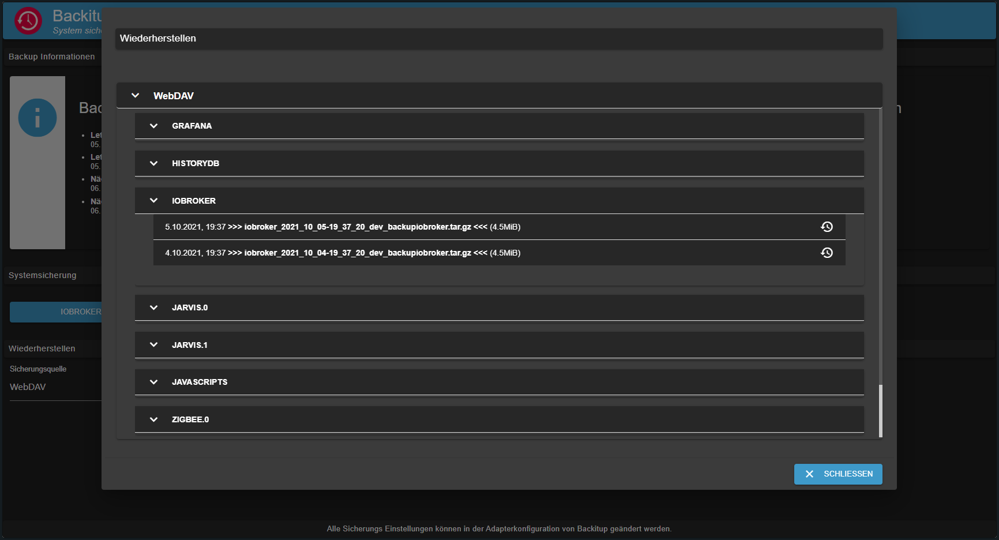

# ioBroker.backitup


[](https://www.npmjs.com/package/iobroker.backitup)
[](https://www.npmjs.com/package/iobroker.backitup)
[](https://david-dm.org/simatec/iobroker.backitup)
[](https://snyk.io/test/github/simatec/ioBroker.backitup)

[](https://travis-ci.org/simatec/ioBroker.backitup)

[](https://nodei.co/npm/iobroker.backitup/)

**Wenn Ihnen Backitup gefällt, denken Sie bitte über eine Spende nach:**
  
[](https://www.paypal.com/cgi-bin/webscr?cmd=_s-xclick&hosted_button_id=Q4EEXQ6U96ZTQ&source=url)

**************************************************************************************************************

# Inhalt
* [Grundlegendes](#grundlegendes)
* [Abhängigkeiten](#abhängkeiten)
* [Benutzung und Bedienung](#Benutzung-und-Bedienung)
* [Backuptypen](#Backuptypen)
	* [ioBroker Backup](#ioBroker-Backup)
	* [CCU Backup (Homematic)](#CCU-Backup-(Homematic))
	* [Mysql-Backup](#Mysql-Backup)
    * [Redis-Backup](#Redis-Backup)
	* [InfluxDB-Backup](#InfluxDB-Backup)
    * [PostgreSQL-Backup](#PostgreSQL-Backup)
    * [Javascript-Backup](#Javascript-Backup)
    * [Jarvis-Backup](#Jarvis-Backup)
    * [Zigbee-Backup](#Zigbee-Backup)
    * [Grafana-Backup](#Grafana-Backup)
    * [Yahka-Backup](#Yahka-Backup)
* [Speicher-Optionen](#Speicher-Optionen)
    * [CIFS](#CIFS)
    * [NFS](#NFS)
    * [FTP](#FTP)
    * [Copy](#Copy)
    * [Dropbox](#Dropbox)
    * [Google Drive](#Google-Drive)
    * [WebDAV](#WebDAV)
* [Multihost Unterstützung](#Multihost-Unterstützung)
* [Docker Unterstützung](#Docker-Unterstützung)
* [Verwendung](#Verwendung)
* [Benachichtigungen](#Benachichtigungen)
* [Restore](#Restore)
* [Fehlersuche](#Fehlersuche)
* [Aufgetretene Fehler / Lösungen](#Aufgetretene-Fehler-/-Lösungen)

---

# Grundlegendes
Backitup ist eine Backuplösung, mit der das zyklische Sichern einer IoBroker-Installation sowie einer Homematic CCU möglich ist.

Der Adapter ist für Multiplattformen geeignet und kann  neben Linux-Installationen auch auf Windows und Mac Installationen verwendet werden.

### [zurück](#Inhalt)
---

# Abhängigkeiten
* Für den CIFS Mount muss zwingend cifs-utils installiert sein.
    - `sudo apt-get install cifs-utils`

* Für den NFS Mount muss zwingend nfs-common installiert sein.
    - `sudo apt-get install nfs-common`

* Für die verwendung des MySql-Backups muss mysqldump auf dem System installiert sein
    - `sudo apt-get install mysql-client` oder unter Debian `sudo apt-get install default-mysql-client`

* Für die verwendung des PostgreSQL-Backups muss mysqldump auf dem System installiert sein
    - [Installationsanleitung PostgreSQL](https://www.postgresql.org/download/linux/debian/)

* Für die Verwendung des InfluxDB Backups muss influxd installiert sein
    - [Installationsanleitung InfluxDB](https://docs.influxdata.com/influxdb/v1.8/introduction/install/)

### [zurück](#Inhalt)
---

# Benutzung und Bedienung
Backitup kann in den Adapter-Instanzen konfiguriert werden. Dort stehen alle folgenden Einstellungsmöglichkeiten zur Verfügung.<br><br>
Für die tägliche Arbeit und Bedienung von Backitup steht im Admin-Tab ein Reiter zur Verfügung.<br>
Ist dieser Reiter im Tab-Menü der Admin-Oberfläche aktiv, kann Backitup direkt über den Reiter in der linken Tab-Leiste des iobrokers bedient werden.<br><br>
Dort stehen Informationen zu den erstellten Backups zur Verfügung, es können Backups erstellt werden und es besteht die Möglichkeit einen Restore des Backups auszuführen.





### [zurück](#Inhalt)
---

# Backuptypen
Backitup bietet sehr viele Möglichkeiten verschiedene Backuptypen zyklisch oder auf Knopfdruck durch zu führen. Jedes Backup wird standardmäßig im Verzeichnis /opt/iobroker/backups/ abgelegt. Optional kann ein FTP-Upload eingerichtet oder alternativ ein CIFS/NFS-Mount genutzt werden.

## ioBroker Backup
Dieses Backup entspricht dem in IoBroker enthaltenen Backup welches man in der Konsole über den Aufruf `iobroker backup` starten kann. Nur wird es hier durch die festgelegten Einstellungen in der Adapterkonfiguration oder dem Widget OneClick-Backup durchgeführt ohne die Konsole verwenden zu müssen.

## CCU Backup (Homematic)
Dieses Backup bietet die Möglichkeit 3 verschiedene Varianten einer Homematic Installations (CCU-Original / pivCCU / Raspberrymatic) zu sichern. Auch die Ausführung dieses Backups kann durch die festgelegten Einstellungen in der Adapterkonfiguration oder dem Widget OneClick-Backup durchgeführt werden.
<br><br>
Wer nicht nur eine CCU sichern will, kann die Option "Sicherung mehrerer Systeme" aktivieren und im Anschluss seine Homematic Zentralen in der Tabelle definieren.

## Mysql-Backup
Dieses separat einstellbare Backup wird sofern es aktiviert ist, bei jedem Backup ioBroker erstellt und nach Ablauf der angegebenen Vorhaltezeit auch gelöscht. FTP oder CIFS sind für dieses Backup ebenfalls gültig sofern bei den anderen IoBroker-Backup-Typen eingestellt.<br><br>
Wichig hierbei ist, dass auch wenn der Mysql-Server auf einem entferten System läuft, die mysqldump auf dem ioBroker System laufen muss.<br>Für Linuxsysteme wäre der Installationsbefehl wie folgt: `sudo apt-get install mysql-client` oder unter Debian `sudo apt-get install default-mysql-client`.<br><br>
Wer nicht nur eine Datenbank sichern will, kann die Option "Sicherung mehrerer Systeme" aktivieren und im Anschluss seine Datenbanken in der Tabelle definieren.

## Redis-Backup
Dieses separat einstellbare Backup wird sofern es aktiviert ist, bei jedem Backup ioBroker erstellt und nach Ablauf der angegebenen Vorhaltezeit auch gelöscht. FTP oder CIFS sind für dieses Backup ebenfalls gültig sofern bei den anderen IoBroker-Backup-Typen eingestellt.<br>
Zur Verwendung von Redis mit Backitup sollten die Rechte für den iobroker-User angepasst werden:<br>
```
sudo usermod -a -G redis iobroker
sudo reboot
```

## History Daten Backup
Dieses separat einstellbare Backup wird sofern es aktiviert ist, bei jedem Backup ioBroker erstellt und nach Ablauf der angegebenen Vorhaltezeit auch gelöscht. FTP oder CIFS sind für dieses Backup ebenfalls gültig sofern bei den anderen IoBroker-Backup-Typen eingestellt.

## InfluxDB-Backup
Dieses separat einstellbare Backup wird sofern es aktiviert ist, bei jedem Backup ioBroker erstellt und nach Ablauf der angegebenen Vorhaltezeit auch gelöscht. FTP oder CIFS sind für dieses Backup ebenfalls gültig sofern bei den anderen IoBroker-Backup-Typen eingestellt.<br><br>
**Um ein InfluxDB Backup ausführen zu können, muss Influxd auf dem iobroker-System installiert sein.**<br>
**Hierbei ist es egal, ob die Datenbank lokal verwaltet wird oder auf einen anderen Server läuft.**<br><br>
Wenn die InfluxDB von einem entfernten Server gesichert werden soll, müssen in der influxdb.conf auf dem entfernten Server die Remote-Rechte für den RPC-Dienst angepasst werden.

```
bind-address = "<InfluxDB-IP>:8088"
```
oder 
```
bind-address = "0.0.0.0:8088"
```

**Nach dem Änderungen in der Konfiguration muss der InfluxDB-Dienst neugestartet werden.**

Weitere Informationen zur Datensicherung der InfluxDB sind [hier](https://docs.influxdata.com/influxdb/v1.8/administration/backup_and_restore/#online-backup-and-restore-for-influxdb-oss) zu finden.<br><br>
Wer nicht nur eine Datenbank sichern will, kann die Option "Sicherung mehrerer Systeme" aktivieren und im Anschluss seine Datenbanken in der Tabelle definieren.

## PostgreSQL-Backup
Dieses separat einstellbare Backup wird sofern es aktiviert ist, bei jedem Backup ioBroker erstellt und nach Ablauf der angegebenen Vorhaltezeit auch gelöscht. FTP oder CIFS sind für dieses Backup ebenfalls gültig sofern bei den anderen IoBroker-Backup-Typen eingestellt.<br><br>
Wichig hierbei ist, dass auch wenn der PostgreSQL-Server auf einem entferten System läuft, die PostgreSQL auf dem ioBroker System laufen muss.<br>Für Linuxsysteme gibt es [hier](https://www.postgresql.org/download/linux/debian/) eine Installationsanleitung.<br><br>
Wer nicht nur eine Datenbank sichern will, kann die Option "Sicherung mehrerer Systeme" aktivieren und im Anschluss seine Datenbanken in der Tabelle definieren.

## Javascript-Backup
Dieses separat einstellbare Backup wird sofern es aktiviert ist, bei jedem Backup ioBroker erstellt und nach Ablauf der angegebenen Vorhaltezeit auch gelöscht. FTP oder CIFS sind für dieses Backup ebenfalls gültig sofern bei den anderen IoBroker-Backup-Typen eingestellt.<br><br>
Ab Backitup-Version 2.2.0 werden Skripte direkt aus den Objekten gesichert. Javascript-Backups aus älteren Backitup-Version sind für einen Restore nicht kompatibel!!<br><br>
Um mit Backitup-Versionen < 2.2.0 Javascript Sicherungen durchführen zu können, muss im Vorfeld in der Javascript-Adapter Konfiguration die Menüpunkte "Spiegeln von Skripten in den Dateipfad" und "Instanz, die Spiegelung macht" festgelegt werden.<br>
Backitup kann dann im Konfiguartionsmenü die Einstellungen übernehmen.

## Jarvis-Backup
Dieses separat einstellbare Backup wird sofern es aktiviert ist, bei jedem Backup ioBroker erstellt und nach Ablauf der angegebenen Vorhaltezeit auch gelöscht. FTP oder CIFS sind für dieses Backup ebenfalls gültig sofern bei den anderen IoBroker-Backup-Typen eingestellt.<br><br>
***Ein Backup der Jarvis-Konfiguration ist ab eine Jarvis-Version 2.2.0-beta.7 möglich.***

## Zigbee-Backup
Dieses separat einstellbare Backup wird sofern es aktiviert ist, bei jedem Backup ioBroker erstellt und nach Ablauf der angegebenen Vorhaltezeit auch gelöscht. FTP oder CIFS sind für dieses Backup ebenfalls gültig sofern bei den anderen IoBroker-Backup-Typen eingestellt.

## Grafana-Backup
Dieses separat einstellbare Backup wird sofern es aktiviert ist, bei jedem Backup ioBroker erstellt und nach Ablauf der angegebenen Vorhaltezeit auch gelöscht. FTP oder CIFS sind für dieses Backup ebenfalls gültig sofern bei den anderen IoBroker-Backup-Typen eingestellt.<br><br>
**Um ein Grafana-Backup erstellen zu können, wird der Benutzername und das Passwort von Grafana benötigt.**<br><br>
**Des Weiteren muss in der Grafana-Weboberfläche ein Api-Key erzeugt werden, um Zugriff auf die Dashboards zu bekommen.**<br>
Der Api-Key kann unter ***"Configuration → API Keys"*** erstellt werden.

## Yahka-Backup
Dieses separat einstellbare Backup wird sofern es aktiviert ist, bei jedem Backup ioBroker erstellt und nach Ablauf der angegebenen Vorhaltezeit auch gelöscht. FTP oder CIFS sind für dieses Backup ebenfalls gültig sofern bei den anderen IoBroker-Backup-Typen eingestellt.<br><br>
Es werden alle Systemeinstellungen und Geräteeinstellungen von Homkit gesichert.

### [zurück](#Inhalt)
---

# Speicher-Optionen

## CIFS
CIFS-Mount ist unter Linux kein Problem.<br>
Es sollte beachtet werden, dass cifs-utils installiert ist

Die Pfadangabe sollte wie folgt aussehen (Bsp: "/Freigabename/Pfadangabe")<br>
Optional kann man aktivieren/deaktivieren, ob die Backups vom NAS gelöscht werden sollen

  ## NFS
NFS-Mount ist unter Linux kein Problem.<br>
Es sollte beachtet werden, dass nfs-common installiert ist<br><br>
Die Pfadangabe sollte wie folgt aussehen (Bsp: "/Freigabename/Pfadangabe").<br>
Optional kann man aktivieren/deaktivieren, ob die Backups vom NAS gelöscht werden sollen

## FTP
FTP ist auf allen OS möglich und dient als eine Alternative zum CIFS Mount<br>
Die Pfadangabe unter FTP muss immer mit "/" beginnen (Bsp: "/Pfadangabe")<br>
Optional kann man aktivieren/deaktivieren, ob die Backups vom NAS gelöscht werden sollen
  
## Copy
Sollte kein CIFS-Mount möglich sein, besteht eine weitere Möglichkeit der Copy-Funktion<br>
Hier muss in den CIFS-Einstellungen die Pfadangabe eingetragen werden, wo hin kopiert werden soll.<br>
Die Angabe der IP Adresse muss für die Copy-Funktion leer bleiben.
  
## Dropbox
Um die Sicherung in der Dropbox zu nutzen, muss ein Access Token und eine APP unter https://www.dropbox.com/developers/apps erstellt werden<br><br>
* Schritt 1: Den Button "Create App" nutzen
* Schritt 2: "Scoped access" auswählen
* Schritt 3: "App folder" auswählen
* Schritt 4: "Name your app" vergeben und "Create App" Button wählen
* Schritt 5: Im Tab-Reiter "Permissions" alle 4 Häckchen im Bereich "Files and folders" setzen
* Schritt 6: Im Tab-Reiter "Settings" die "Access token expiration" auf "No expiration" stellen
* Schritt 7: "Generated access token" Button drücken (Dieser erzeugte Token wird in den Einstellungen von Backitup eingetragen)<br><br>
In deiner Dropbox gibt es nun einen neuen Ordner mit dem Namen "Apps"
  
## Google Drive
Um die Sicherung in der Google Drive zu nutzen, muss ein Access Token holen. Das kann man auf der Konfigurationsseite machen.<br>
ioBroker greift nur auf die definierte Bereiche an. Das Code für oAuth kann man [hier](https://github.com/simatec/ioBroker.backitup/blob/master/docs/oAuthService.js) ansehen.<br><br>
Keine Tokens oder Anwenderdaten werden in der Cloud gespeichert.

## WebDAV
Mit WebDAV bietet Backitup die Möglichkeit mehrere Cloudsysteme anzusprechen.<br>Die bekannteste ist hier NextCloud.
Um eine WebDAV-Verbindung herzustellen, weren der Username und das Passwort des Cloud Accounts benötigt.<br>
Die Verbindung zur Cloud erfolgt über eine verschlüsselte Verbindung.<br><br>
Um eine Verbindung aufbauen zu können, muss der Hostname der Cloud alle Sicherheitszertifikate erfüllen.<br><br>
> Beispiel URL: "https://example.com/remote.php/dav/files/username/"<br><br>
Eine Verbindung mit lokaler IP-Adresse ist nur möglich, wenn die Option "Nur signierte Zertifikate zulassen" deaktiviert ist.

### [zurück](#Inhalt)
---

# Multihost Unterstützung
Ab Backitup Version 2.2.0 wird Multihost für die Sicherung entfernter Systeme (z.B. Zigbee oder entfernte Datenbanken) unterstützt. Multihost für Backitup kann mit mehreren Instanzen von Backitup auf verschiedenen Hosts arbeiten.<br>
Ein Instanz von Backitup muss zur Unterstützung als Master konfiguriert. Alle weiteren Instanzen, die sich auf entfernten Hosts befinden, werden als Slave konfiguriert.<br><br>
Das Management der automatischen Backups übernimmt der Master. Alle Slave Instanzen können im Master über das Menü ausgewählt werden.<br>
Für die Slave Instanzen können folgende Backup-Optionen aktiviert werden:<br>
* Redis
* Zigbee
* Jarvis
* History
* InfluxDB
* MySql
* PostgreSql
* Grafana
* Yahka

Da in einer Slave Instanz die automatischen Backups durch den Master geregelt werden, sind iobroker-Backups, Javascript-Backups und CCU-Backups nicht auswählbar.<br><br>
Die Speicherorte für die einzelnen Backups können auf jedem Slave frei konfiguriert werden. So kann jeder sein Dateiablagesystem unabhängig vom Master gestallten.<br><br>

Bei Systemen mit begrenzten RAM kann der Backitup Master die Slave Instanzen für den Backupprozess automatisch starten und im Anschluss wieder stoppen.<br>
Diese Option ist im Menü konfigurierbar. 

### [zurück](#Inhalt)
---

# Docker Unterstützung
Ab Version 2.2.0 wird das Backup und der Restore im offizielen Docker-Container unterstützt.<br><br>
Da im Docker keine Datenbanksysteme installiert werden sollten, werden Backups sämtlicher Datenbanken nicht unterstützt und sind bei einem erkannten Docker-Container nicht auswählbar.<br>
Die Unterstützung für Backitup wird im offizielen iobroker Docker Container ab Version v5.2.0-beta4 unterstützt.

### [zurück](#Inhalt)
---

# Verwendung
1.	Der Adapter erstellt einige Datenpunkte zur Verwendung in Vis<br>
	* oneClick.ccu -> dient als Auslösetrigger für ein CCU-Backup (Kann in Vis durch einen Button auf true gesetzt werden)
	* oneClick.iobroker -> dient als Auslösetrigger für ein Standard-Backup (Kann in Vis durch einen Button auf true gesetzt werden)<br><br>
	* history.html -> dient als History-Log welcher in Vis via CCS vom Design anpassbar ist.
    * history.json -> dient als History-Log welcher in Vis via CCS vom Design anpassbar ist.
	* history.ccuLastTime -> speichert das Erstell-Datum und die Uhrzeit des letzten CCU Backups
	* history.minimalLastTime -> speichert das Erstell-Datum und die Uhrzeit des letzten Standard Backups
    * history.ccuSuccess -> zeigt bei erfolgreichen Backup den State "true"
    * history.minimalSuccess -> zeigt bei erfolgreichen Backup den State "true"
    * history.iobrokerLastTime -> zeigt die letzte ioBroker Sicherung
    * history.ccuLastTime -> zeigt die letzte CCU Sicherung
    * info.ccuNextTime -> zeigt die nächste Ausführungszeit des CCU-Backups
    * info.iobrokerNextTime -> zeigt die nächste Ausführungszeit des ioBroker-Backups
    * info.latestBackup -> zeigt als json das letzte beim Start ermittelte Backup

2. History-Log in Vis anzeigen
   - Es ist möglich den History-Log bspw. in einem Html-Widget durch eintragen folgender Zeile in HTML darzustellen:
```
{backitup.0.history.html}
```
Syntax: {BackitupInstanz.history.html}


3. CCS-Formatierung des History-Logs:
```
   .html{
       display:block;
       width:100%;
   /*    overflow-y:scroll; */
   }
   .backup-type-iobroker
       {
           float:left;
           color:white;
           font-size:20px;
       }
   .backup-type-ccu
       {
           float:left;
           color:red;
           font-size:20px;
    }
   ```
4. OneClick-Button mit Status-Text
   - Wenn ein OneClick-Datenpunkt auf true gesetzt wird startet das entsprechende Backup und nach einer vordefinierten Zeit wird dieser Datenpunkt wieder auf false gesetzt somit ist es möglich einen Button mit Status zu erstellen, hierzu folgende Zeile anpassen und in Vis als Knopftext eintragen:

```
{wert: backitup.0.oneClick.iobroker; wert === "true" || wert === true ? "Minimal Backup </br> wird erstellt" : "Minimal Backup </br> starten"}

```

Syntax: {wert: <BackitupInstanz>.oneClick.<Auslösetrigger>; wert === "true" || wert === true ? "Text während der Backuperstellung" : "Standard-Text"}

### [zurück](#Inhalt)
---

# Benachichtigungen
 Backitup unterstützt für die Benachrichtigung nach einem erfolgreichen Backup folgende Messenger.
 Zur Verwendung müssen die jeweiligen Adapter installiert und eigerichtet sein.

   * Telegram
   * Pushover
   * E-Mail 
   * Whatsapp

### [zurück](#Inhalt)
---

# Restore

Mit Backitup ist es möglich, alle erzeugten Backup-Typen über das Konfiguartionsmenü im ioBroker auch wiederherzustellen.<br><br>
Es kann aus allen Speichermedien ein Restore ausgeführt werden.<br><br>
**Grundsätzlich ist aber der sicherste Weg, den Restore lokal auszuführen.**<br><br>
Wer den sichersten Weg wählt und den Restore lokal ausführen möchte, muss die Backupdatei im iobroker Backup-Ordner ablegen.
Auf Linuxsystemen befindet sich dieser Ordner unter folgenden Pfad: `/opt/iobroker/backups`

Bei den Backuptypen "iobroker" und "redis" wird beim Restore der iobroker gestoppt und im Anschluss automatisch wieder gestartet.<br>
Nach dem Stop des iobrokers öffnet sich ein neuer Browser-Tab, in dem der Verlauf des Restores zu sehen ist.<br><br>
***Falls dieser Tab nicht öffnet, müssen die Browser-Einstellungen für Popups blockieren kontrolliert werden.***<br><br>

**Bei allen anderen Backuptypen wird iobroker nicht gestoppt. Hier werden lediglich die betroffnenen Adapter kurzzeitig gestoppt.**<br><br>

Wer seine Backups lieber manuell wiederherstellen möchte, sollte folgende Punkte durchführen:

***Restore eines IoBroker Backups:***
    - Das Backup muss wie gewohnt im  Verzeichnis `opt/iobroker/backups` liegen
    - Es kann über die Konsole mit Hilfe des Befehls: `iobroker restore <Backupdateiname>` wieder hergestellt werden.
    - Nach dem Restore ist ein `iobroker upload all` nötig


Eine detailierte Anleitung zum Restore mit Backitup und auch zum manuellen Restore ist [hier](https://forum.iobroker.net/topic/27271/howto-iobroker-restore-unter-linux-durchf%C3%BChren) zu finden.

**Das CCU-Backup muss weiterhin über das Webinterface der CCU wiederhergestellt werden.**

***Restore eines Raspberrymatic / CCU Backups:***
    - *.sbk Datei via SCP in das Verzeichnis „ /usr/local/tmp directory“ auf die Raspberrymatic  kopieren
    - Über die Konsole  als Root-User  auf der Raspberrymatic einloggen
    - Den Befehl: „/bin/restoreBackup.sh /user/local/tmp/EuerBackupDateiname“ auf der Raspberrymatic ausführen.
    - Den Befehl:“reboot“ auf der Raspberrymatic ausführen um den PI neu zu starten
    - Alternativ kann das Backup natürlich auch wie gewohnt über das Webinterface wieder hergestellt werden.

### [zurück](#Inhalt)
---

# Fehlersuche
    Um Fehler zu loggen, muss Backitup in unter dem IoBroker Reiter Instanzen auf Log-Stufe "debug" gestellt werden.

### [zurück](#Inhalt)
--- 

# Aufgetretene Fehler / Lösungen:
Hier eine Liste der bisher aufgetretenen Probleme und deren Lösungen sofern vorhanden.

1.	Olifall (aus dem Forum) hatte das Problem dass nach dem Restore das Webinterface des IoBrokers nicht mehr erreichbar war, durch folgende Schritte über die Konsole konnte er dies beheben:
    - sudo iobroker status
    - Meldung = "No connection to states 127.0.0.0:6379[redis]"
    - sudo apt-get install redis-server

2.	Sollte der CIFS-Mount mit IP-Adresse nicht möglich sein, sollte der Hostname des NAS verwendet werden
3.  Wenn ihr beim cifs-mount ein Passwort mit Sonderzeichen verwendet, haben User festgestellt, dass dann das Passwort mit Anführungszeichen in der Config hinterlegt werden muss.
4.  cifs-mount kann laut einigen Usern mit sehr langen Passwörtern nicht umgehen. Falls der mount nicht klappen sollte, kürz das Passwort etwas ein (12 Zeichen sind funktionieren bei mir).
5.  Sollte der Adapter sich nicht installieren lassen, prüft eure Versionen von node und nodejs. Der Adapter unterstützt Versionen < Node 8 nicht.
6.  Wenn euer iobroker System mit dem neuen Installer Script installiert wurde, kann es vorkommen, dass ihr nicht alle Rechte für den neuen User iobroker habt. 
    Dies betrifft dann leider auch backitup, da backitup einige systemrelevante Befehle benutzt.

    Um das Problem mit fehlenden Rechten zu beheben, gibt es inzwischen einen Fix für den Installerscript von iobroker.
    Führt bitte folgende Befehle auf eure Iobrokerumgebung in der Konsole aus:

    ```
    iobroker stop
    iobroker fix
    sudo reboot
    ```
7.  Solltet Ihr eine Fehlermeldung beim erstellen der Redis Datenbank bekommen, prüft bitte, ob euer User iobroker die Rechte hat und ob er in der User-Gruppe Redis vorhanden ist.
    Wenn dies nicht der Fall ist, könnt ihr das mit folgenden Befehl in der Konsole beheben.
    
    ```
    sudo usermod -a -G redis iobroker
    sudo reboot
    ```
    Wenn ihr nicht mit dem Installerscript eure Iobroker Installation aufgesetzt habt und euer User einen anderen Namen hat, bitte in dem Befehl "iobroker" durch euren User ersetzen.

8.  Wenn eine Fritzbox als NAS mit einer Firmware >= 7.21 verwendet wird, sollten in Backitup die SMB-Einstellungen auf "3.1.1" eingestellt und die Option "noserverino" aktiviert werden.

### [zurück](#Inhalt)
---
