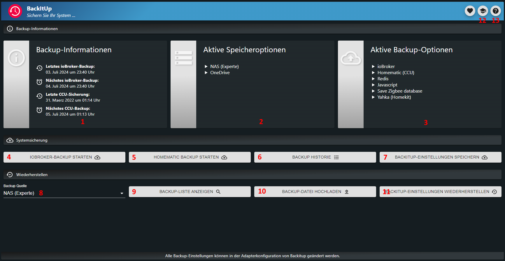
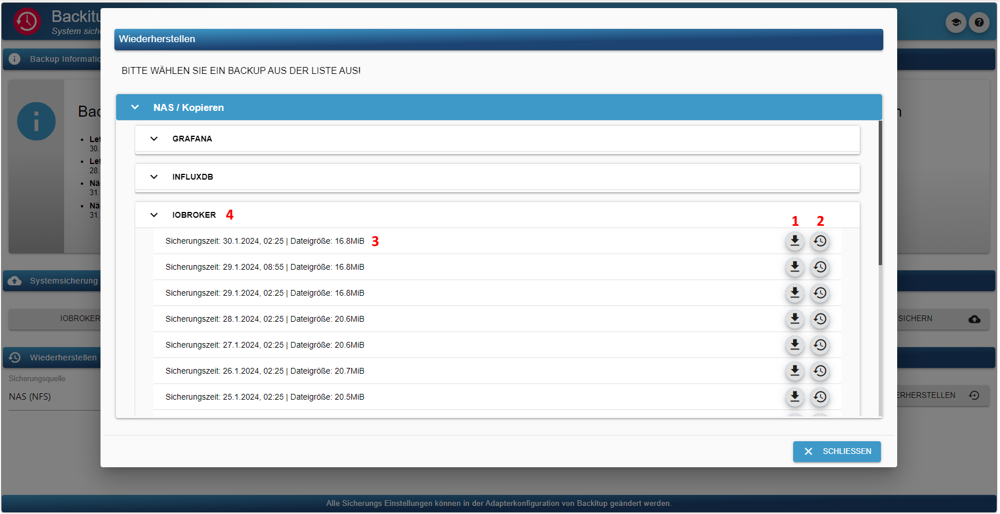
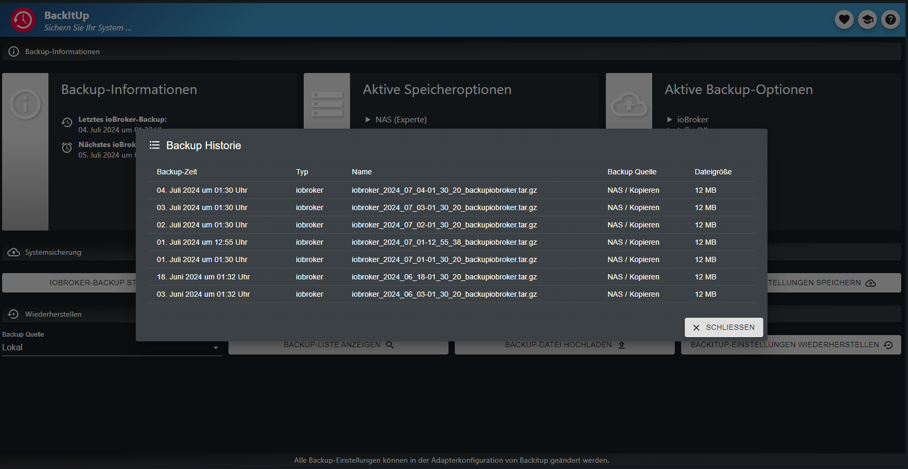

# Documentation and instructions for ioBroker.backitup


[](https://www.npmjs.com/package/iobroker.backitup)
[](https://www.npmjs.com/package/iobroker.backitup)
[](https://snyk.io/test/github/simatec/ioBroker.backitup)


[](https://github.com/simatec/ioBroker.backitup/blob/master/LICENSE)
[](https://paypal.me/mk1676)
[](https://github.com/sponsors/simatec)


**************************************************************************************************************


## Support adapter development
**If you like ioBroker.backitup, please consider making a donation:**
  
[](https://paypal.me/mk1676)


**************************************************************************************************************

## Disclaimer
**ioBroker.backitup is backup plugin only for the smart home software ioBroker.**<br>
**Is it not affiliated with or endorsed by [Nero BackItUp](https://www.nero.com/deu/products/nero-backitup/?vlang=en) (a Tool backup under Windows-Systems).**

**This personal project ioBroker.backitup is maintained in spare time and has no business goal.**

**************************************************************************************************************

## Basics
ioBroker.backitup is a backup solution with which the cyclical backup of an ioBroker installation and a Homematic CCU is possible.

The adapter is suitable for multi-platforms and can be used on Windows and Mac installations in addition to Linux installations.

Furthermore, there is the possibility to save various optional backups such as SQL databases, Influx databases and some adapter and device settings.

ioBroker.backitup works very closely with the js-controller and creates an ioBroker backup identical to the CLI command `iobroker backup`.

All states and objects as well as the user files such as VIS are backed up here identically to the standard backup of the js-controller.

Additionally ioBroker.backitup backs up other options like InfluxDB, Grafana and Redis.
All available options can be found here in the documentation.

With the CLI command `iob backup` only the pure ioBroker backup is currently executed.


The restore is also completely identical to the CLI command `iobroker restore <backupname>` of the js-controller.

With a restore, all states, objects and user data are restored by Backup.
After the restore, your iobroker restarts and from there the js-controller takes over the installation of missing adapters again.

ioBroker.backitup has no effect whatsoever on the recovery after the ioBroker has started. This all happens in the background and the js-controller takes over based on the restored information in the States and Objects.

_[Back to top](#documentation-and-instructions-for-iobrokerbackitup)_

---


## Dependencies
* For the CIFS mount cifs-utils must be installed.
     - `sudo apt install cifs-utils`

* Nfs-common must be installed for the NFS mount.
     - `sudo apt install nfs-common`

* To use the mysql backup from mysql systems, mysqldump must be installed on the system.
    - `sudo apt install mysql-client` or under Debian `sudo apt install default-mysql-client`.

* For using the MySql backup of MariaDB systems mysqldump must be installed on the system
    - `sudo apt install mariadb-client`

* To use the sqlite3 backup, sqlite3 must be installed on the system.
    - `sudo apt install sqlite3`

* To use the PostgreSQL backup, mysqldump must be installed on the system
     - [Installation instructions PostgreSQL](https://www.postgresql.org/download/linux/debian/)

* Influxd must be installed to use the InfluxDB backup
     - [Installation instructions InfluxDB 1.x](https://docs.influxdata.com/influxdb/v1.8/introduction/install/)
     - [Installation instructions InfluxDB 2.x](https://docs.influxdata.com/influxdb/v2.1/install/)
     - [Installation instructions Influx-CLI für 2.x](https://docs.influxdata.com/influxdb/v2.1/tools/influx-cli/?t=Linux)

_[Back to top](#documentation-and-instructions-for-iobrokerbackitup)_

---


## Use and operation
ioBroker.backitup can be configured in the adapter instances. All of the following setting options are available there.<br><br>
A tab is available in the admin tab for the daily work and operation of ioBroker.backitup.<br>
If this tab is active in the tab menu of the admin interface, ioBroker.backitup can be operated directly via the tab in the left tab bar of the iobroker.<br><br>
Information on the backups made is available there, backups can be made and the backup can be restored.



Here is a brief explanation of the options in the Menu tab


| No.           | Description   |
| ------------- | ------------- |
| 1.    | Information on the last and next backup. |
| 2.    | Information on where the backups are stored. |
| 3.    | Information on which backup types are active and being backed up. |
| 4.    | Start an iobroker backup manually. |
| 5.    | Start a Homematic backup manually. |
| 6.    | Opens a new window and displays all backups from the history. |
| 7.    | With this button you can save the settings of ioBroker.backitup. This is a useful tool when changing systems. The settings are output in JSON format. |
| 8.    | This option is used to select the memory from which the restore is to be executed. |
| 9.    | With the "Retrieve backups" button, a new window opens and lists all existing backups in the selected memory. |
| 10.   | If you want to restore a backup from another system, the backup file can be uploaded to the system using this button. |
| 11.   | This button is used to restore the saved ioBroker.backitup settings within the adapter. It is not a restore of the ioBroker and only files in JSON format can be uploaded here! |
| 12.   | Opens a new tab and shows the documentation of ioBroker.backitup. |
| 13.   | Opens a new tab and shows the readme of ioBroker.backitup. |




The operation of the Restore tab is as follows.


| No.           | Description                               |
| ------------- | -------------                             |
| 1.            | Download the selected backup to the PC.   |
| 2.            | Start the restore of the selected backup. |
| 3.            | Information about the backup.             |
| 4.            | Information about the backup type.        |




_[Back to top](#documentation-and-instructions-for-iobrokerbackitup)_

---


## Backup types
ioBroker.backitup offers a lot of possibilities to carry out different backup types cyclically or at the push of a button. By default, every backup is stored in the /opt/iobroker/backups/ directory. Optionally, an FTP upload can be set up or, alternatively, a CIFS / NFS mount can be used.

### ioBroker backup
This backup corresponds to the backup contained in ioBroker which can be started in the console by calling `iobroker backup`. Only here it is carried out through the specified settings in the adapter configuration or the OneClick Backup widget without having to use the console.

### CCU backup (Homematic)
This backup offers the possibility to save 3 different variants of a Homematic installation (CCU-Original / pivCCU / Raspberrymatic). This backup can also be performed using the settings specified in the adapter configuration or the OneClick backup widget.<br> <br>
If you don't want to secure just one CCU, you can activate the "Securing multiple systems" option and then define your Homematic central units in the table.

> [!IMPORTANT]
> A backup of the CCU can only be carried out with the user `Admin` of the CCU!

### Mysql backup
If activated, this separately adjustable backup is created with every ioBroker backup and is also deleted after the specified retention time has expired. FTP or CIFS are also valid for this backup if the other ioBroker backup types are set.<br><br>
It is important that even if the mysql server is running on a remote system, the mysqldump must run on the ioBroker system. <br> For Linux systems, the installation command would be as follows: `sudo apt install mysql-client` or under Debian `sudo apt install default-mysql-client` or for MariaDB-Systems `sudo apt install mariadb-client`.<br> <br>
If you don't want to back up just one database, you can activate the "Back up multiple systems" option and then define your databases in the table.

### Sqlite3 backup
If it is activated, this separately adjustable backup is created with every backup ioBroker and also deleted after the specified retention time has expired. FTP or CIFS are also valid for this backup if set for the other ioBroker backup types.<br><br>
Sqlite3 (`sudo apt install msqlite3`) must be installed on the host system.

### Redis backup
If activated, this separately adjustable backup is created with every ioBroker backup and deleted after the specified retention period has expired. FTP or CIFS are also valid for this backup provided the other ioBroker backup types are set. <br>
To use Redis with ioBroker.backitup, the rights for the iobroker user should be adjusted: <br>
```
sudo usermod -a -G redis iobroker
sudo reboot
```

For a remote backup, redis-cli is required on the local ioBroker system.

`sudo apt install redis-tools`


Here you have to enter your host and port of the remote Redis server and the login data of your system.

This is an important feature, especially for Docker users.

Please note that a Redis restore for remote systems is not possible via the backup GUI.Redis does not support this.
Here the dump.rdb contained in the tar.gz archive must be restored manually. To do this, the backup archive must be unpacked, the file copied to the Redis directory and the rights for the dump.rdb adjusted.

Here's an example:
```
sudo tar -xvzf <backup file>.tar.gz /var/lib/redis/
sudo chown redis:redis /var/lib/redis/dump.rdb
redis-cli shutdown nosave
```

### History data backup
If activated, this separately adjustable backup is created with every ioBroker backup and deleted after the specified retention period has expired. FTP or CIFS are also valid for this backup, provided that the other ioBroker backup types are set.

### InfluxDB backup
If activated, this separately adjustable backup is created with every ioBroker backup and deleted after the specified retention period has expired. FTP or CIFS are also valid for this backup if the other ioBroker backup types are set.<br><br>
**Requirements for a remote backup with InfluxDB v1.x:**

Some adjustments are necessary for the remote backup under InfluxDB 1.x.

**To be able to perform an InfluxDB backup, Influxd must be installed on the iobroker system.** <br>
**It does not matter whether the database is managed locally or on another server.**<br><br>
If the InfluxDB is to be backed up from a remote server, the remote rights for the RPC service must be adjusted in influxdb.conf on the remote server.

``
bind-address = "<InfluxDB-IP>: 8088"
``
or
``
bind-address = "0.0.0.0:8088"
``

**After changing the configuration, the InfluxDB service must be restarted.**

Further information on the data backup of the InfluxDB can be found [here] (https://docs.influxdata.com/influxdb/v1.8/administration/backup_and_restore/#online-backup-and-restore-for-influxdb-oss).<br> <br>

**Requirements for a backup with InfluxDB v2.x:**

In order to be able to create a backup of an InfluxDB 2.x, Influx-CLI must be installed on your system.
This is required for both a local and remote backup.

For a remote backup, Influx-CLI must be installed on the system on which your ioBroker is also running.
On the remote system where your database is working, installation for backup is not required.

Here you will find the official instructions on how to install Influx-CLI on your system.

[Installation guide Influx-CLI for 2.x](https://docs.influxdata.com/influxdb/v2.1/tools/influx-cli/?t=Linux)<br><br>

If you don't just want to back up one database, you can activate the "Backup of multiple systems" option and then define your databases in the table.<br>

> [!IMPORTANT]
> To create and restore an InfluxDB2 backup, the operator token is required!

### PostgreSQL backup
If activated, this separately adjustable backup is created with every ioBroker backup and deleted after the specified retention period has expired. FTP or CIFS are also valid for this backup if the other ioBroker backup types are set.<br><br>
What is important here is that even if the PostgreSQL server is running on a remote system, PostgreSQL must run on the ioBroker system / debian /) an installation guide.<br> <br>
If you don't want to back up just one database, you can activate the "Back up multiple systems" option and then define your databases in the table.

### Javascript backup
If activated, this separately adjustable backup is created with every ioBroker backup and is also deleted after the specified retention period has expired. FTP or CIFS are also valid for this backup if the other ioBroker backup types are set.<br><br>
As of ioBroker.backitup version 2.2.0, scripts are saved directly from the objects. Javascript backups from older backup versions are not compatible for a restore!!<br><br>
In order to be able to carry out JavaScript backups with ioBroker.backitup versions <2.2.0, the menu items "Mirroring scripts in the file path" and "Instance that makes the mirroring" must be specified in advance in the Javascript adapter configuration.<br>
ioBroker.backitup can then take over the settings in the configuration menu.

### Jarvis backup
If activated, this separately adjustable backup is created with every ioBroker backup and deleted after the specified retention period has expired. FTP or CIFS are also valid for this backup if the other ioBroker backup types are set.<br><br>

### Zigbee backup
If activated, this separately adjustable backup is created with every ioBroker backup and deleted after the specified retention period has expired. FTP or CIFS are also valid for this backup, provided that the other ioBroker backup types are set.

### Zigbee2MQTT backup
This backup, which can be set separately, is created with every backup ioBroker if it is activated and is also deleted after the specified retention time has expired. FTP or CIFS are also valid for this backup if set for the other IoBroker backup types.

The path in the ioBroker.backitup adapter should always be created directly to the `data` path of zigbee2mqtt.
Example: `/opt/zigbee2mqtt/data` or directly into the volume of a Docker installation of zigbee2mqtt.

It is also important here that the user "iobroker" gets permissions to the data folder to be able to read and write the files.

Group permissions can be set as follows:

```
sudo usermod -a -G <zigbe2mqtt User> iobroker
sudo reboot
```

### Node-Red-Backup
This backup, which can be set separately, is created with every backup ioBroker if it is activated and is also deleted after the specified retention time has expired. FTP or CIFS are also valid for this backup if set for the other ioBroker backup types.

### Grafana backup
If activated, this separately adjustable backup is created with every ioBroker backup and deleted after the specified retention period has expired. FTP or CIFS are also valid for this backup if the other IoBroker backup types are set.<br>

> [!IMPORTANT]
> In order to be able to create a Grafana backup, the Grafana username (Admin) and password are required.
> Furthermore, an API key or service token must be created in the Grafana web interface to get access to the dashboards.


The API key can be created under ***"Configuration → API Keys or Service Token"*** and must have full admin permissions.

### Yahka backup
If activated, this separately adjustable backup is created with every ioBroker backup and is also deleted after the specified retention period has expired. FTP or CIFS are also valid for this backup if the other ioBroker backup types are set. <br> <br>
All system settings and device settings from Homekit are saved.

_[Back to top](#documentation-and-instructions-for-iobrokerbackitup)_

---


## Storage options

### Local
The default location for backups in ioBroker is `/opt/iobroker/backups`.
This is set by the system and cannot be changed.
If none of the CIFS or NFS mounts listed below are active, all backups will end up in the default path and will be local to the host system.

Additional storage options such as a cloud or FTP will only create a copy of the backup to the selected location outside the host system.

### CIFS
CIFS mount is no problem under Linux.<br>
It should be noted that cifs-utils is installed.

The path specification should look like this (example: "/share name/path specification")<br>
You can optionally activate / deactivate whether the backups should be deleted from the NAS

### NFS
NFS mount is no problem under Linux.<br>
It should be noted that nfs-common is installed.<br><br>
The path specification should look like this (example: "/share name/path specification").<br>
You can optionally activate / deactivate whether the backups should be deleted from the NAS

### FTP
FTP is possible on all OS and serves as an alternative to the CIFS Mount.<br>
The path specification under FTP must always begin with "/" (example: "/path specification")<br>
You can optionally activate / deactivate whether the backups should be deleted from the NAS
  
### Copy
If a CIFS mount is not possible, there is another possibility of the copy function.<br>
Here in the CIFS settings the path must be entered where the copy is to be made.<br>
The specification of the IP address must remain empty for the copy function.

### Expert Mount
In the Expert area, it is possible to create your own mount command, which the adapter then uses for a backup and a restore.
Here you can work individually and, for example, integrate the fstab or credentials.

> [!WARNING]
> Please note that this option is only intended for experts.

### Dropbox
In order to use the backup in Dropbox, you have to get an access token. This can be done on the ioBroker.backitup configuration page.<br>
ioBroker only accesses the defined areas. No tokens or user data are stored in the cloud.

If you want to create your own Dropbox API app, you can select this in the ioBroker.backitup settings and then have to carry out the following steps.
 
> Note: Own apps only have a "short_live" token, which is only valid for 4 hours. We recommend using the ioBroker standard app.
 
To use the backup in Dropbox, an access token and an APP must be created at https://www.dropbox.com/developers/apps<br><br>
* Step 1: Use the "Create App" button
* Step 2: Select "Scoped access".
* Step 3: Select "App folder".
* Step 4: Enter "Name your app" and select "Create App" button
* Step 5: In the "Permissions" tab, check all 4 boxes in the "Files and folders" area
* Step 6: In the "Settings" tab, set the "Access token expiration" to "No expiration".
* Step 7: Press "Generated access token" button (This generated token is entered in the settings of ioBroker.backitup)

In your Dropbox there is now a new folder called "Apps".
  
### Google Drive
In order to use the backup in the Google Drive, you have to get an Access token. You can do that on the configuration page.<br>
ioBroker only accesses the defined areas. The code for oAuth can be viewed [here](https://github.com/simatec/ioBroker.backitup/blob/master/docs/oAuthService.js).<br><br>
No tokens or user data are stored in the cloud.

### Onedrive
In order to use the backup in the Onedrive, you have to get an access token. This can be done on the configuration page of ioBroker.backitup.<br>
ioBroker only accesses the defined areas. No tokens or user data are stored in the cloud.

### WebDAV
With WebDAV, ioBroker.backitup offers the possibility to address several cloud systems. The best known is NextCloud.
To establish a WebDAV connection, the username and password of the cloud account are required.<br>
The connection to the cloud is made via an encrypted connection.<br><br>
In order to be able to establish a connection, the host name of the cloud must meet all security certificates.
> Example URL: "https://example.com/remote.php/dav/files/username/"<br><br>
A connection with a local IP address is only possible if the option "Only allow signed certificates" is deactivated.

_[Back to top](#documentation-and-instructions-for-iobrokerbackitup)_

---


## Delete old backups
ioBroker.backitup can delete older backups automatically. The number of backups to be kept can be defined in the configuration of ioBroker.backitup.
Deletion of older backups only occurs when the adapter performs an automatic scheduled backup.

> [!NOTE]
> In case of manual backups, older backup files are not deleted.

> [!IMPORTANT]
> If an error occurs during the backup process, older backups will also not be deleted for security reasons. 

Which backups were deleted and possible errors during deletion are output in Debuglog.

_[Back to top](#documentation-and-instructions-for-iobrokerbackitup)_

---


## Multihost support
Multihost for ioBroker.backitup can work with multiple instances of ioBroker.backitup on different hosts.<br>
An instance of ioBroker.backitup must be configured as a master to support it. All other instances on remote hosts are configured as slaves.<br><br>
The master takes over the management of the automatic backups. All slave instances can be selected in the master via the menu.<br>
The following backup options can be activated for the slave instances:<br>
* Redis
* Zigbee
* Jarvis
* History
* InfluxDB
* MySql
* Sqlite3
* PostgreSql
* Grafana
* Yahka
* Node-Red
* Zigbee2MQTT

Since the automatic backups are controlled by the master in a slave instance, iobroker backups, Javascript backups and CCU backups cannot be selected.<br><br>
The storage locations for the individual backups can be freely configured on each slave. So everyone can design their file storage system independently of the master.<br><br>

In systems with limited RAM, the backup master can automatically start the slave instances for the backup process and then stop them again.<br>
This option can be configured in the menu.

_[Back to top](#documentation-and-instructions-for-iobrokerbackitup)_

---


## Docker support
Since no database systems should be installed in the Docker container, backups of all databases are not supported and cannot be selected in a recognised Docker container by default. To be able to back up external databases anyway, two container environment variables must be set:

* IOB_BACKITUP_EXTDB=true
* PACKAGES

The content of the environment variable "PACKAGES" is based on the packages to be installed, which are necessary for access to the respective database. Examples would be "mysql-client" or "redis-tools". Further details can be found [here](https://docs.buanet.de/iobroker-docker-image/docs_backitup/).

In order to be able to use ioBroker.backitup in Docker to its full extent, some ports still need to be mapped.

* Port 8091 - Restore web interface
* Port 9081 - file server for download of backups via the web interface of ioBroker.backitup
* Port 9082 - file server for uploads of backups via the web interface of ioBroker.backitup

_[Back to top](#documentation-and-instructions-for-iobrokerbackitup)_

---


## Use
1. The adapter creates some data points for use in Vis<br>
    * oneClick.ccu -> serves as a trigger for a CCU backup (can be set to true in Vis using a button)
    * oneClick.iobroker -> serves as a trigger for a standard backup (can be set to true in Vis with a button)<br><br>
    * history.html -> serves as a history log which can be adapted from the design in Vis via CCS.
    * history.json -> serves as a history log which can be adapted from the design in Vis via CCS.
    * history.ccuLastTime -> saves the creation date and time of the last CCU backup
    * history.minimalLastTime -> saves the creation date and time of the last standard backup
    * history.ccuSuccess -> shows the state "true" if the backup is successful
    * history.minimalSuccess -> shows the state "true" if the backup is successful
    * history.iobrokerLastTime -> shows the last ioBroker backup
    * history.ccuLastTime -> shows the last CCU backup
    * info.ccuNextTime -> shows the next execution time of the CCU backup
    * info.iobrokerNextTime -> shows the next execution time of the ioBroker backup
    * info.latestBackup -> shows as json the last backup determined at the start

2. show backup history log in Vis
   - The backup history log shows the last x backups.
   - The number of history entries displayed can be set in the Extra settings.
   - It is possible to display the history log e.g. in an HTML widget by entering the following line in HTML:
```
{backitup.0.history.html}
```
Syntax: {BackitupInstance.history.html}

3. CCS formatting of the history log
```
   .html{
       display:block;
       width:100%;
   /*    overflow-y:scroll; */
   }
   .backup-type-iobroker
       {
           float:left;
           color:white;
           font-size:20px;
       }
   .backup-type-ccu
       {
           float:left;
           color:red;
           font-size:20px;
    }
   ```
4. OneClick button with status text
    - If a OneClick data point is set to true the corresponding backup starts and after a predefined time this data point is set to false again so it is possible to create a button with status, adjust the following line and enter it in Vis as button text:
```
{value: backitup.0.oneClick.iobroker; value === "true" || value === true ? "iobroker Backup </br> will be created" : "iobroker Backup </br> starten"}
```

Syntax: {value: <BackitupInstance>.oneClick.<trigger>; value ==="true" || value === true ? "Text during backup creation" : "Standard text"}

_[Back to top](#documentation-and-instructions-for-iobrokerbackitup)_

---


## Notifications
  ioBroker.backitup supports the following messengers for notification after a successful backup.
  The respective adapters must be installed and set up for use.

    * Telegram
    * Pushover
    * Email
    * Whatsapp
    * Signal
    * Matrix
    * Discord

_[Back to top](#documentation-and-instructions-for-iobrokerbackitup)_

---


## Restore
With ioBroker.backitup it is possible to restore all backup types created via the configuration menu in the ioBroker.<br><br>
ioBroker.backitup works very closely with the js-controller and creates an iobroker backup identical to the CLI command `iobroker backup`.

All states and objects as well as the user files such as VIS are backed up here identically to the standard backup of the js-controller.

The restore is also completely identical to the CLI command `iobroker restore <backupname>` of the js-controller.

With a restore, all states, objects and user data are restored by Backup.
After the restore, your iobroker restarts and from there the js-controller takes over the installation of missing adapters again.

ioBroker.backitup has no effect whatsoever on the recovery after the iobroker has started. This all happens in the background and the js-controller takes over based on the restored information in the States and Objects.

A restore can be carried out from all storage media.<br><br>

> [!NOTE]
> Basically, however, the safest way is to execute the restore locally.


If you choose the safest way and want to do the restore locally, you have to store the backup file in the ioBroker backup folder.
On Linux systems this folder is located under the following path: `/opt/iobroker/backups`

With the backup types "ioBroker" and "redis", the ioBroker is stopped during the restore and then restarted automatically. <br>
After stopping the ioBroker, a new browser tab opens showing the progress of the restore.<br><br>
***If this tab does not open, the browser settings for block popups must be checked.***<br><br>

**ioBroker is not stopped with all other backup types. Here only the affected adapters are temporarily stopped.**<br><br>

If you prefer to restore your backups manually, you should do the following:

***Restore an ioBroker backup:***
    - As usual, the backup must be in the directory `opt/iobroker/backups`
    - It can be restored via the console using the command: `iobroker restore <Backupfilename>`.
    - After the restore an `iobroker upload all` is necessary

Detailed instructions for restoring with Backup and also for manual restoring can be found [here] (https://github.com/simatec/ioBroker.backitup/wiki/%5BHowTo%5D-Restore-auf-Linux-Distributionen).

**The CCU backup must still be restored via the CCU's web interface.**

***Restore a Raspberrymatic / CCU backup:***
    - Copy the * .sbk file via SCP into the directory "/usr/local/tmp" directory on the Raspberrymatic
    - Log in to the Raspberrymatic as a root user via the console
    - Execute the command: “/bin/restoreBackup.sh /user/local/tmp/BackupFileName” on the Raspberrymatic.
    - Execute the command: “reboot“ on the Raspberrymatic to restart the PI
    - Alternatively, the backup can of course also be restored as usual via the web interface.

_[Back to top](#documentation-and-instructions-for-iobrokerbackitup)_

---


## Troubleshooting
To log errors, ioBroker.backitup must be set to log level "debug" under the ioBroker tab "Instances".

_[Back to top](#documentation-and-instructions-for-iobrokerbackitup)_

---


## Errors / solutions encountered
Here is a list of the problems that have occurred so far and their solutions, if any.

1.Olifall (from the forum) had the problem that the web interface of the ioBroker was no longer accessible after the restore, he was able to fix this by taking the following steps on the console:
    - sudo iobroker status
    - Message = "No connection to states 127.0.0.0:6379[redis]"
    - sudo apt install redis-server

2. If the CIFS mount with IP address is not possible, the host name of the NAS should be used
3. If you use a password with special characters for the CIFS mount, users have found that the password must then be stored in the config with quotation marks.
4. According to some users, CIFS mount cannot handle very long passwords. If the mount doesn't work, shorten the password a little (12 characters work for me).
5. If the adapter cannot be installed, check your versions of node and nodejs. The adapter does not support versions <Node 8.
6. If your iobroker system was installed with the new installer script, it may happen that you do not have all rights for the new user iobroker.
    Unfortunately, this also applies to backitup, as backitup uses some system relevant commands.

    To fix the problem with missing rights, there is a fix for the iobroker installer script.
    Please execute the following commands on your ioBroker environment in the console:
    ```
    iobroker stop
    iobroker fix
    sudo reboot
    ```
7. If you get an error message when creating the Redis database, please check whether your user iobroker has the rights and whether he is in the Redis user group.
    If this is not the case, you can fix it with the following command in the console.
    ```
    sudo usermod -a -G redis iobroker
    sudo reboot
    ```
    If you have not set up your ioBroker installation with the installer script and your user has a different name, please replace "iobroker" with your user in the command.

8. If a Fritzbox is used as a NAS with a firmware > = 7.21, the SMB settings should be set to "3.1.1" in ioBroker.backitup and the "noserverino" option should be activated.

_[Back to top](#documentation-and-instructions-for-iobrokerbackitup)_

---