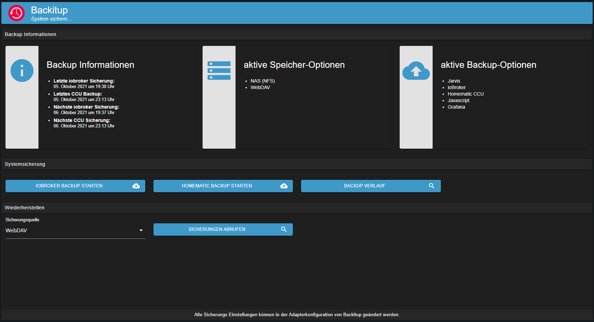
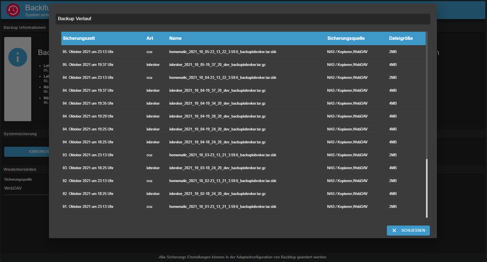

# ioBroker.backitup


[](https://www.npmjs.com/package/iobroker.backitup)
[](https://www.npmjs.com/package/iobroker.backitup)
[](https://david-dm.org/simatec/iobroker.backitup)
[](https://snyk.io/test/github/simatec/ioBroker.backitup)

[](https://travis-ci.org/simatec/ioBroker.backitup)

[](https://nodei.co/npm/iobroker.backitup/)

**If you like Backitup, please consider making a donation:**
  
[](https://www.paypal.com/cgi-bin/webscr?cmd=_s-xclick&hosted_button_id=Q4EEXQ6U96ZTQ&source=url)

**************************************************************************************************************

# Content
* [Basic](#basic)
* [Dependencies](#Dependencies)
* [Use and operation](#Use-and-operation)
* [Backup types](#Backup-types)
    * [ioBroker Backup](#ioBroker-Backup)
    * [CCU Backup (Homematic)](#CCU-Backup-(Homematic))
    * [Mysql-Backup](#Mysql-backup)
    * [Redis-Backup](#Redis-backup)
    * [InfluxDB-Backup](#InfluxDB-backup)
    * [PostgreSQL backup](#PostgreSQL-backup)
    * [Javascript-Backup](#Javascript-backup)
    * [Jarvis backup](#Jarvis-backup)
    * [Zigbee backup](#Zigbee-backup)
    * [Grafana backup](#Grafana-backup)
    * [Grafana backup](#Yahka-backup)
* [Storage options](#Storage-options)
     * [CIFS](#CIFS)
     * [NFS](#NFS)
     * [FTP](#FTP)
     * [Copy](#Copy)
     * [Dropbox](#Dropbox)
     * [Google Drive](#Google-Drive)
     * [WebDAV](#WebDAV)
* [Multihost support](#Multihost-support)
* [Docker support](#Docker-support)
* [Usage](#usage)
* [Notifications](#notifications)
* [Restore](#Restore)
* [Troubleshooting](#troubleshooting)
* [Errors / solutions encountered](#Errors-/-solutions-encountered)

---

# Basics
Backitup is a backup solution with which the cyclical backup of an IoBroker installation and a Homematic CCU is possible.

The adapter is suitable for multi-platforms and can be used on Windows and Mac installations in addition to Linux installations.

### [back](#Content)
---

# Dependencies
* For the CIFS mount cifs-utils must be installed.
     - `sudo apt-get install cifs-utils`

* Nfs-common must be installed for the NFS mount.
     - `sudo apt-get install nfs-common`

* To use the MySql backup, mysqldump must be installed on the system
     - `sudo apt-get install mysql-client` or under Debian `sudo apt-get install default-mysql-client`

* To use the PostgreSQL backup, mysqldump must be installed on the system
     - [Installation instructions PostgreSQL](https://www.postgresql.org/download/linux/debian/)

* Influxd must be installed to use the InfluxDB backup
     - [Installation instructions InfluxDB](https://docs.influxdata.com/influxdb/v1.8/introduction/install/)

### [back](#Content)
---

# Use and operation
Backitup can be configured in the adapter instances. All of the following setting options are available there.<br><br>
A tab is available in the admin tab for the daily work and operation of Backitup.<br>
If this tab is active in the tab menu of the admin interface, Backitup can be operated directly via the tab in the left tab bar of the iobroker.<br><br>
Information on the backups made is available there, backups can be made and the backup can be restored.





### [back](#Content)
---

# Backup types
Backitup offers a lot of possibilities to carry out different backup types cyclically or at the push of a button. By default, every backup is stored in the / opt / iobroker / backups / directory. Optionally, an FTP upload can be set up or, alternatively, a CIFS / NFS mount can be used.

## ioBroker backup
This backup corresponds to the backup contained in IoBroker which can be started in the console by calling `iobroker backup`. Only here it is carried out through the specified settings in the adapter configuration or the OneClick Backup widget without having to use the console.

## CCU backup (Homematic)
This backup offers the possibility to save 3 different variants of a Homematic installation (CCU-Original / pivCCU / Raspberrymatic). This backup can also be performed using the settings specified in the adapter configuration or the OneClick backup widget.<br> <br>
If you don't want to secure just one CCU, you can activate the "Securing multiple systems" option and then define your Homematic central units in the table.

## Mysql backup
If activated, this separately adjustable backup is created with every ioBroker backup and is also deleted after the specified retention time has expired. FTP or CIFS are also valid for this backup if the other IoBroker backup types are set.<br><br>
It is important that even if the mysql server is running on a remote system, the mysqldump must run on the ioBroker system. <br> For Linux systems, the installation command would be as follows: `sudo apt-get install mysql-client` or under Debian `sudo apt-get install default-mysql-client`.<br> <br>
If you don't want to back up just one database, you can activate the "Back up multiple systems" option and then define your databases in the table.

## Redis backup
If activated, this separately adjustable backup is created with every ioBroker backup and deleted after the specified retention period has expired. FTP or CIFS are also valid for this backup provided the other IoBroker backup types are set. <br>
To use Redis with Backitup, the rights for the iobroker user should be adjusted: <br>
```
sudo usermod -a -G redis iobroker
sudo reboot
```

## History data backup
If activated, this separately adjustable backup is created with every ioBroker backup and deleted after the specified retention period has expired. FTP or CIFS are also valid for this backup, provided that the other IoBroker backup types are set.

## InfluxDB backup
If activated, this separately adjustable backup is created with every ioBroker backup and deleted after the specified retention period has expired. FTP or CIFS are also valid for this backup if the other IoBroker backup types are set.<br><br>
**To be able to perform an InfluxDB backup, Influxd must be installed on the iobroker system.** <br>
**It does not matter whether the database is managed locally or on another server.**<br><br>
If the InfluxDB is to be backed up from a remote server, the remote rights for the RPC service must be adjusted in influxdb.conf on the remote server.

``
bind-address = "<InfluxDB-IP>: 8088"
``
or
``
bind-address = "0.0.0.0:8088"
``

**After changing the configuration, the InfluxDB service must be restarted.**

Further information on the data backup of the InfluxDB can be found [here] (https://docs.influxdata.com/influxdb/v1.8/administration/backup_and_restore/#online-backup-and-restore-for-influxdb-oss).<br> <br>
If you don't want to back up just one database, you can activate the "Back up multiple systems" option and then define your databases in the table.

## PostgreSQL backup
If activated, this separately adjustable backup is created with every ioBroker backup and deleted after the specified retention period has expired. FTP or CIFS are also valid for this backup if the other IoBroker backup types are set.<br><br>
What is important here is that even if the PostgreSQL server is running on a remote system, PostgreSQL must run on the ioBroker system / debian /) an installation guide.<br> <br>
If you don't want to back up just one database, you can activate the "Back up multiple systems" option and then define your databases in the table.

## Javascript backup
If activated, this separately adjustable backup is created with every ioBroker backup and is also deleted after the specified retention period has expired. FTP or CIFS are also valid for this backup if the other IoBroker backup types are set.<br><br>
As of Backitup version 2.2.0, scripts are saved directly from the objects. Javascript backups from older backup versions are not compatible for a restore !!<br><br>
In order to be able to carry out JavaScript backups with Backitup versions <2.2.0, the menu items "Mirroring scripts in the file path" and "Instance that makes the mirroring" must be specified in advance in the Javascript adapter configuration.<br>
Backitup can then take over the settings in the configuration menu.

## Jarvis backup
If activated, this separately adjustable backup is created with every ioBroker backup and deleted after the specified retention period has expired. FTP or CIFS are also valid for this backup if the other IoBroker backup types are set.<br><br>
***A backup of the Jarvis configuration is possible from Jarvis version 2.2.0-beta.7.***

## Zigbee backup
If activated, this separately adjustable backup is created with every ioBroker backup and deleted after the specified retention period has expired. FTP or CIFS are also valid for this backup, provided that the other IoBroker backup types are set.

## Grafana backup
If activated, this separately adjustable backup is created with every ioBroker backup and deleted after the specified retention period has expired. FTP or CIFS are also valid for this backup if the other IoBroker backup types are set.<br><br>
**In order to be able to create a Grafana backup, the Grafana username and password are required.**<br><br>
**Furthermore, an API key must be generated in the Grafana web interface in order to get access to the dashboards.** <br>
The API key can be created under ***"Configuration → API Keys"***.

## Yahka backup
If activated, this separately adjustable backup is created with every ioBroker backup and is also deleted after the specified retention period has expired. FTP or CIFS are also valid for this backup if the other IoBroker backup types are set. <br> <br>
All system settings and device settings from Homkit are saved.

### [back](#Content)
---

# Storage options

## CIFS
CIFS mount is no problem under Linux.<br>
It should be noted that cifs-utils is installed

The path specification should look like this (example: "/ share name / path specification")<br>
You can optionally activate / deactivate whether the backups should be deleted from the NAS

## NFS
NFS mount is no problem under Linux.<br>
It should be noted that nfs-common is installed<br><br>
The path specification should look like this (example: "/ share name / path specification").<br>
You can optionally activate / deactivate whether the backups should be deleted from the NAS

## FTP
FTP is possible on all OS and serves as an alternative to the CIFS Mount<br>
The path specification under FTP must always begin with "/" (example: "/ path specification")<br>
You can optionally activate / deactivate whether the backups should be deleted from the NAS
  
## Copy
If a CIFS mount is not possible, there is another possibility of the copy function<br>
Here in the CIFS settings the path must be entered where the copy is to be made.<br>
The specification of the IP address must remain empty for the copy function.
  
## Dropbox
To use the backup in the Dropbox, an access token and an APP must be created at https://www.dropbox.com/developers/apps<br><br>
* Step 1: Use the "Create App" button
* Step 2: Select "Scoped access"
* Step 3: Select "App folder"
* Step 4: Enter "Name your app" and select the "Create App" button
* Step 5: In the "Permissions" tab, set all 4 ticks in the "Files and folders" area
* Step 6: In the "Settings" tab, set the "Access token expiration" to "No expiration"
* Step 7: Press the "Generated access token" button (This generated token is entered in the Backitup settings)<br><br>
In your Dropbox there is now a new folder called "Apps"
  
## Google Drive
In order to use the backup in the Google Drive, an access token must be obtained. This can be done on the configuration page. <br>
ioBroker only attacks the defined areas. The code for oAuth can be viewed [here] (https://github.com/simatec/ioBroker.backitup/blob/master/docs/oAuthService.js).<br><br>
No tokens or user data are stored in the cloud.

## WebDAV
With WebDAV, Backitup offers the possibility to address several cloud systems. <br> The best known is NextCloud.
To establish a WebDAV connection, the username and password of the cloud account are required.<br>
The connection to the cloud is made via an encrypted connection.<br><br>
In order to be able to establish a connection, the host name of the cloud must meet all security certificates.
A connection with a local IP address is not possible because it does not contain any Lets Encrypt certificates.<br><br>
> Example URL: "https://example.com/remote.php/dav/files/username/"<br><br>
A connection with a local IP address is only possible if the option "Only allow signed certificates" is deactivated.

### [back](#Content)
---

# Multihost support
From Backitup version 2.2.0, multihost is supported for backing up remote systems (e.g. Zigbee or remote databases). Multihost for Backitup can work with multiple instances of Backitup on different hosts.<br>
An instance of Backitup must be configured as a master to support it. All other instances on remote hosts are configured as slaves.<br><br>
The master takes over the management of the automatic backups. All slave instances can be selected in the master via the menu.<br>
The following backup options can be activated for the slave instances:<br>
* Redis
* Zigbee
* Jarvis
* History
* InfluxDB
* MySql
* PostgreSql
* Grafana
* Yahka

Since the automatic backups are controlled by the master in a slave instance, iobroker backups, Javascript backups and CCU backups cannot be selected.<br><br>
The storage locations for the individual backups can be freely configured on each slave. So everyone can design their file storage system independently of the master.<br><br>

In systems with limited RAM, the backup master can automatically start the slave instances for the backup process and then stop them again.<br>
This option can be configured in the menu.

### [back](#Content)
---

# Docker support
As of version 2.2.0, backup and restore are supported in the official Docker container.<br><br>
Since no database systems should be installed in Docker, backups of all databases are not supported and cannot be selected when a Docker container is detected.<br>
The support for Backitup is supported in the official iobroker Docker Container from version v5.2.0-beta4.

### [back](#Content)
---

# Use
1. The adapter creates some data points for use in Vis<br>
    * oneClick.ccu -> serves as a trigger for a CCU backup (can be set to true in Vis using a button)
    * oneClick.iobroker -> serves as a trigger for a standard backup (can be set to true in Vis with a button)<br><br>
    * history.html -> serves as a history log which can be adapted from the design in Vis via CCS.
    * history.json -> serves as a history log which can be adapted from the design in Vis via CCS.
    * history.ccuLastTime -> saves the creation date and time of the last CCU backup
    * history.minimalLastTime -> saves the creation date and time of the last standard backup
    * history.ccuSuccess -> shows the state "true" if the backup is successful
    * history.minimalSuccess -> shows the state "true" if the backup is successful
    * history.iobrokerLastTime -> shows the last ioBroker backup
    * history.ccuLastTime -> shows the last CCU backup
    * info.ccuNextTime -> shows the next execution time of the CCU backup
    * info.iobrokerNextTime -> shows the next execution time of the ioBroker backup
    * info.latestBackup -> shows as json the last backup determined at the start

2. Show history log in Vis
   - It is possible to display the history log e.g. in an HTML widget by entering the following line in HTML:

```
{backitup.0.history.html}
```
Syntax: {BackitupInstance.history.html}


3. CCS formatting of the history log
```
   .html{
       display:block;
       width:100%;
   /*    overflow-y:scroll; */
   }
   .backup-type-iobroker
       {
           float:left;
           color:white;
           font-size:20px;
       }
   .backup-type-ccu
       {
           float:left;
           color:red;
           font-size:20px;
    }
   ```
4. OneClick button with status text
    - If a OneClick data point is set to true the corresponding backup starts and after a predefined time this data point is set to false again so it is possible to create a button with status, adjust the following line and enter it in Vis as button text:
```
{value: backitup.0.oneClick.iobroker; value === "true" || value === true ? "iobroker Backup </br> will be created" : "iobroker Backup </br> starten"}

```
Syntax: {value: <BackitupInstance>.oneClick.<trigger>; value ==="true" || value === true ? "Text during backup creation" : "Standard text"}

### [back](#Content)
---

# Notifications
  Backitup supports the following messengers for notification after a successful backup.
  The respective adapters must be installed and set up for use.

    * Telegram
    * Pushover
    * Email
    * Whatsapp

### [back](#Content)
---

# Restore

With Backitup it is possible to restore all backup types created via the configuration menu in the ioBroker.<br><br>
A restore can be carried out from all storage media.<br><br>
** Basically, however, the safest way is to execute the restore locally. **<br><br>
If you choose the safest way and want to do the restore locally, you have to store the backup file in the iobroker backup folder.
On Linux systems this folder is located under the following path: `/opt/iobroker/backups`

With the backup types "iobroker" and "redis", the iobroker is stopped during the restore and then restarted automatically. <br>
After stopping the iobroker, a new browser tab opens showing the progress of the restore.<br><br>
***If this tab does not open, the browser settings for block popups must be checked.***<br><br>

**iobroker is not stopped with all other backup types. Here only the affected adapters are temporarily stopped.**<br><br>

If you prefer to restore your backups manually, you should do the following:

***Restore an IoBroker backup:***
    - As usual, the backup must be in the directory `opt/iobroker/backups`
    - It can be restored via the console using the command: `iobroker restore <Backupfilename>`.
    - After the restore an `iobroker upload all` is necessary


Detailed instructions for restoring with Backup and also for manual restoring can be found [here] (https://forum.iobroker.net/topic/27271/howto-iobroker-restore-unter-linux-durchf%C3%BChren).

**The CCU backup must still be restored via the CCU's web interface.**

***Restore a Raspberrymatic / CCU backup:***
    - Copy the * .sbk file via SCP into the directory "/usr/local/tmp directory" on the Raspberrymatic
    - Log in to the Raspberrymatic as a root user via the console
    - Execute the command: “/bin/restoreBackup.sh /user/local/tmp / EuerBackupDateiname” on the Raspberrymatic.
    - Execute the command: “reboot“ on the Raspberrymatic to restart the PI
    - Alternatively, the backup can of course also be restored as usual via the web interface.

### [back](#Content)
---

# Troubleshooting:

In order to make mistakes, Backitup must be set to log level "debug" in the IoBroker rider instances

### [back](#Content)
---

# Errors / solutions encountered

Here is a list of the problems that have occurred so far and their solutions, if any.

1.Olifall (from the forum) had the problem that the web interface of the IoBroker was no longer accessible after the restore, he was able to fix this by taking the following steps on the console:
    - sudo iobroker status
    - Message = "No connection to states 127.0.0.0:6379[redis]"
    - sudo apt-get install redis-server

2. If the CIFS mount with IP address is not possible, the host name of the NAS should be used
3. If you use a password with special characters for the cifs-mount, users have found that the password must then be stored in the config with quotation marks.
4. According to some users, cifs-mount cannot handle very long passwords. If the mount doesn't work, shorten the password a little (12 characters work for me).
5. If the adapter cannot be installed, check your versions of node and nodejs. The adapter does not support versions <Node 8.
6. If your iobroker system was installed with the new installer script, it may happen that you do not have all rights for the new user iobroker.
    Unfortunately, this also applies to backitup, as backitup uses some system-relevant commands.

    To fix the problem with missing rights, there is now a fix for the iobroker installer script.
    Please execute the following commands on your Iobroker environment in the console:

    ``
    iobroker stop
    iobroker fix
    sudo reboot
    ``
7. If you get an error message when creating the Redis database, please check whether your user iobroker has the rights and whether he is in the Redis user group.
    If this is not the case, you can fix it with the following command in the console.
    
    ``
    sudo usermod -a -G redis iobroker
    sudo reboot
    ``
    If you have not set up your Iobroker installation with the installer script and your user has a different name, please replace "iobroker" with your user in the command.

8. If a Fritzbox is used as a NAS with a firmware > = 7.21, the SMB settings should be set to "3.1.1" in Backitup and the "noserverino" option should be activated.

### [back](#Content)
---